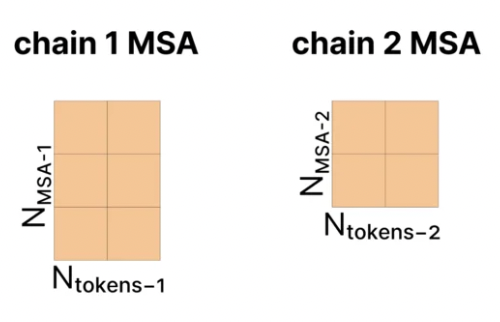
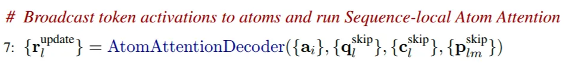
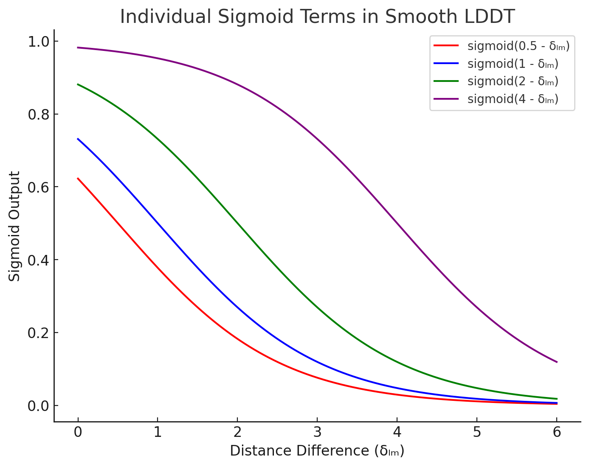
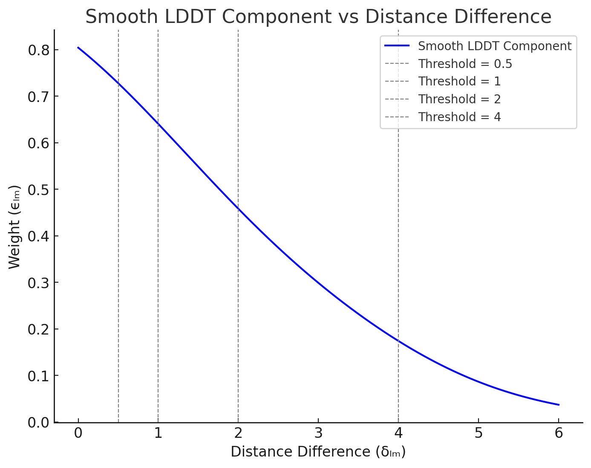

# AlphaFold 3, Demystified: A Comprehensive Technical Breakdown of Its Architecture and Design

by Yichong Shen

> This technical deep dive is inspired by [The Illustrated AlphaFold](https://elanapearl.github.io/blog/2024/the-illustrated-alphafold/). Special thanks to Elana Pearl for the visual resources.

# Input Preparation

## **How are MSA and Templates obtained?**

- Why do we need MSA?

  - Different versions of a certain type of protein existing across different species may have similar sequences and structures. By collecting these proteins together, we can observe how certain positions of a protein change with evolution.
  - Each row of the MSA represents similar proteins from different species. Conservative patterns in columns can reflect the importance of requiring specific amino acids at that position. The relationships between different columns reflect the interactions between amino acids (if two amino acids physically interact, their amino acid changes during evolution may also be correlated). Therefore, MSA is often used to enrich the representation of a single protein.
- Why do we need Templates: Similarly, if the aforementioned MSA contains known structures, then it is very likely to help predict the structure of the current protein. Templates only focus on single-chain structures.
- How to obtain MSA?

  - Use genetic search to find similar protein or RNA chains. One chain typically searches for N_msa (<16384) similar chains:

    
  - If there are multiple chains, and if they can be paired from the same species, then the MSA matrix may take this form:

    
  - Otherwise, it forms a diagonal matrix like this:

    
- How to obtain Templates?

  - Use Template Search. For the generated MSA, use HMM to search for similar protein sequences in the PDB database, then select the 4 highest quality structures from these matched sequences as templates.
- How to characterize Templates?

  - Calculate the Euclidean distance between each token and token, using discretized distance representation (specifically, values are divided into 38 intervals, ranging from 3.15Å to 50.75Å, plus an additional interval representing distances exceeding 50.75Å).
  - If certain tokens contain multiple atoms, select the central atom for distance calculation, for example, Cα is the central atom of amino acids, and C1 is the central atom of nucleotides.
  - Templates only contain distance information on the same chain, ignoring interactions between chains.

## **How to construct Atom-level representations?**

- Constructing p and q: [Corresponding to Algorithm 5 AtomAttentionEncoder]
  - To construct atom-level single representation, we first need all atomic-level features. The first step is to construct a reference conformer for each amino acid, nucleotide, and ligand. The reference conformer can be looked up or calculated through specific methods, serving as local prior three-dimensional structural information.
  - c is the result after concatenating various features in the reference conformer and then performing a linear transformation. The shape of c is [C_atom=128, N_atoms], where C_atom is the feature dimension after linear transformation of each atom, and N_atoms is the total number of atoms in the sequence. c_l represents the features of the atom at position l, and c_m represents the features of the atom at position m.

    
  - The atom-level single representation q is initialized through c:

    
  - Then use c to initialize the atom-level pair representation p (atom-level pair representation). p represents the relative distances between atoms. The specific process is as follows:

    1. Calculate the distance between atomic reference three-dimensional coordinates, resulting in a three-dimensional vector.

       
    2. Since the atomic reference three-dimensional coordinates are only obtained for their own reference conformations and are local information, distances are only calculated within tokens (amino acids, nucleotides, ligands, etc.). Therefore, we need to calculate a mask v. Only when chain_id and residue_idx are the same will coordinate position differences be calculated between each other. In this case, v is 1, otherwise v is 0.

       
    3. Calculate p, with shape [N_atoms, N_atoms, C_atompair=16]:

       

       - The p(l,m) vector has dimension [C_atompair]. The calculation method is to pass the d(l,m) three-dimensional vector through a linear layer to get a vector with dimension C_atompair, while multiplying by a scalar v(l,m) used for masking.
       - The inverse square of the distances 1/(1+||d(l,m)||^2) is a scalar, then undergoes linear transformation to become a [C_atompair] vector, still multiplied by the masking scalar v(l,m). p(l,m) = p(l,m) + this new vector.
       - Finally, p(l,m) is added with the mask scalar.

       

       - p(l,m) also needs to add information from the original c, including information from c(:, l) and c(:, m). Both pieces of information first go through relu and then linear transformation, transformed into C_atompair vectors, and added to p(l,m).
       - Finally p(l,m) = p(l,m) + three-layer MLP(p(l,m))
- Updating q (Atom Transformer):
  1. Adaptive LayerNorm: [Corresponding to Algorithm 26 AdaLN]

     - The inputs are c and q, both with shape [C_atom, N_atoms]. c serves as a secondary input, mainly used to calculate the gamma and beta values for q, thus dynamically adjusting the layerNorm result of q through c.
     - Specifically, normal LayerNorm works like this:

       
     - Then Adaptive Layer Norm works like this:

       

       - The formula is as follows:

         

         - Here a is q, and s is c.
         - During calculation, sigmoid(Linear(s)) is equivalent to the new gamma, and LinearNoBias(s) is equivalent to the new beta.
  2. Attention with Pair Bias [Corresponding to Algorithm 24 AttentionPairBias]:

     - The inputs are q and p, where q has shape [C_atom, N_atoms] and p has shape [N_atoms, N_atoms, C_atompair].
     - As a typical Attention structure, (Q, K, V) all come from q, with shape [C_atom, N_atoms].
       - Assuming N_head-headed attention, where a_i represents the vector q_i of the i-th atom in q, then for the h-th head and the i-th q vector, we get (q_h_i, k_h_i, v_h_i):

         

         - The dimension c is obtained as follows:

           
       - Pair-biasing: Where does it come from? Extract the i-th row from p, i.e., the relationship between the i-th atom and other atoms. Then p_i_j is the relationship between the i-th atom and the j-th atom, with vector shape [C_atompair]. In the formula, z_i_j is used to represent p_i_j.

         - z_i_j first undergoes LayerNorm in the C_atompair dimension, then undergoes linear transformation, reducing from C_atompair dimension to 1 dimension:

           
         - Then introduce this pair Bias before calculating softmax. At this time, for the vectors q_h_i and k_h_i of the i-th atom and j-th atom, first perform vector dot product and scale, then add a scalar b_h_i_j before softmax to get the weight A_h_i_j:

           
         - Then directly calculate the attention result for the i-th atom:

           
       - Gating: Obtain the vector of the i-th atom from q:

         - First perform a linear transformation, changing from c_atom dimension to Head dimension c, then directly calculate sigmoid, mapping it to a number between 0 and 1 as gating.

           
         - Then element-wise multiply with the attention result, finally concatenate all Heads, and finally undergo a linear transformation to get the attention result q_i with shape [C_atom].

           
       - Sparse attention: Since the number of atoms is much larger than the number of tokens, when calculating atom attention, from a computational perspective, we don't calculate attention of one atom to all atoms, but calculate local attention, called sequence-local atom attention. The specific method is:

         - When calculating attention, make the softmax result of positions (i,j) that we don't care about approximately 0, which is equivalent to setting the value at specific positions (i,j) to negative infinity before softmax, distinguished by the introduced beta_i_j:

           

           - If the distance between i and j satisfies the condition, then atom attention needs to be calculated, and beta_i_j is 0.
           - If the distance between i and j doesn't satisfy the condition, then attention doesn't need to be calculated, and beta_i_j is -10^10.
  3. Conditioned Gating: [Corresponding to Algorithm 24 AttentionPairBias]

     - The inputs are c and q, with shapes [C_atom, N_atoms] and [C_atom, N_atoms] respectively, and the output is q with shape [C_atom, N_atoms].
     - Here s_i in the formula is actually c_i. First perform a linear transformation, then calculate sigmoid, mapping each element in c_i to between 0 and 1, finally element-wise multiply with a_i, which is actually q_i, to get the updated q_i:

       
  4. Conditioned Transition: [Corresponding to Algorithm 25 ConditionalTransitionBlock]

     - The inputs are c, q, and p, with shapes [C_atom, N_atoms], [C_atom, N_atoms], and [N_atoms, N_atoms, C_atompair] respectively, and the output is q with shape [C_atom, N_atoms].
     - The last module of Atom Transformer, this is equivalent to the MLP layer in Transformer. It's called Conditional because it's contained between the Adaptive LayerNorm layer (step 3 above) and Conditional Gating (step 3 above). The only difference is whether the middle part is MLP or Attention.
       - The first step is still an Adaptive LayerNorm:

         
       - The second step is a swish:

         
       - The third step is Conditional Gating:

         

## **How to construct Token-level representations?**

- Constructing Token-level Single Sequence Representation
  - The input is q, atom-level single representation, with shape [C_atom, N_atoms]. The outputs are S_inputs and S_init, with shapes [C_token+65, N_tokens] and [C_token, N_tokens] respectively.
  - First, transform each atom's representation dimension C_atom through linear transformation to C_token, then apply relu activation function, then average all atom representations within the same token to get N_token vectors of C_token dimension. [From Algorithm 5 AtomAttentionEncoder]

    
  - Then for tokens with MSA features, concatenate residue_type (32) and MSA features (MSA properties: 32+1) to get S_input. [From Algorithm 2 InputFeatureEmbedder]

    
  - Finally, perform another linear transformation to convert S_input to S_init. [From Algorithm 1 MainInferenceLoop]

    

    - Note: Here C_s is C_token = 384
- Constructing Token-level Pair Representation [From Algorithm 1 MainInferenceLoop]
  - The input is S_init with shape [C_token=384, N_tokens], and the output is Z_init with shape [N_tokens, N_tokens, C_z=128].
  - To calculate Z_init_i_j, we need to get features of two specific tokens, perform linear transformations on them separately, then add them to get the first z_i_j, with vector length transformed from C_tokens (i.e., C_s=384) to C_z=128.

    
  - Then add relative position encoding at position (i,j) of z:

    

    - Detailed explanation of RelativePositionEncoding: Note that both i and j here refer to tokens. [From Algorithm 3 RelativePositionEncoding]

      

      - a_residue_i_j: Residue relative position information:
        - If tokens i and j are in the same chain, then d_residue_i_j is the relative position difference between residue i and residue j, ranging from [0, 65].
        - If tokens i and j are not in the same chain, then d_residue_i_j = 2*r_max+1 = 65
        - a_residue_i_j is a one-hot encoding of length 66, where the position of 1 is the value of d_residue_i_j.
      - a_token_i_j: Token relative position information:
        - If tokens i and j are in the same residue (for modified amino acids or nucleotides, one atom is one token), then d_token_i_j is the difference between different residue indices, ranging from [0, 65].
        - If tokens i and j are not in the same residue, take the maximum value d_token_i_j = 2*r_max+1 = 65
        - a_token_i_j is a one-hot encoding of length 66, where the position of 1 is the value of d_token_i_j.
      - a_chain_i_j: Chain relative position information:
        - If tokens i and j are not in the same chain, then d_chain_i_j is the index difference between chains, ranging from [0, 5].
        - If tokens i and j are in the same chain, then d_chain_i_j is set to the maximum value 5.
        - a_chain_i_j is a one-hot encoding of length 6, where the position of 1 is the value of d_chain_i_j.
      - b_same_entity_i_j: If tokens i and j are in the same entity (completely identical amino acid sequences are unique entities with unique entity ids), it's 1, otherwise 0.
      - Finally, concatenate [a_residue_i_j, a_token_i_j, b_same_entity_i_j, a_chain_i_j] to get a vector of length 66+66+1+6 = 139 = C_rpe.
      - Then undergo another linear transformation to transform the vector dimension to C_z=128 dimension.
  - Finally, add token bond information, which after linear transformation is added to z_i_j to get the final result.

    

# Representation Learning

## Template Module

- What are the inputs to the Template Module?

  - token-level pair representation { z_i_j } and features containing template information {**f**}.
- How are Template features constructed? [From Algorithm 16 TemplateEmbedder]

  

  1. For template t, b_template_backbone_frame_mask_i_j is calculated through the template_backbone_frame_mask values at positions i and j of the t-th template. Only when both positions i and j contain all atoms that can be used to calculate the backbone, this mask result is 1, otherwise 0.
  2. Similarly, only when the template_pseudo_beta_mask at positions i and j of the t-th template are both 1, this b_template_pseudo_beta_mask_i_j mask is 1, otherwise 0. This means whether the central atom has coordinates at positions i and j.
  3. a_t_i_j calculates related features at positions i and j of the t-th template, concatenating the last dimension of template_distogram (representing distances between two tokens, with shape [N_templ, N_token, N_token, 39]) with b_template_backbone_frame_mask_i_j (1-dimensional scalar), the last dimension of template_unit_vector (representing unit vectors with direction between two tokens, with shape [N_templ, N_token, N_token, 3]), and b_template_pseudo_beta_mask_i_j (1-dimensional scalar) to form a 44-dimensional vector.
  4. If the token at position i and the token at position j are not on the same chain, then the a_t_i_j vector is set to an all-zero vector.
  5. a_t_i_j is then concatenated with the residue type (one-hot encoding) at position i and the residue type information at position j of template t, resulting in an a_t_i_j vector of [44+32+32 =108]. The shape of {a_t_i_j} is [N_templ, N_token, N_token, 108].
- Then perform the same operations for each template: [From Algorithm 16 TemplateEmbedder]

  

  1. First define u_i_j to store calculation results, with shape [N_token, N_token, c] for {u_i_j}.
  2. For each template, perform the same operations: perform linear transformation on a_t_i_j from 108 dimensions → c dimensions, perform LN on z_i_j first, then perform linear transformation from c_z dimensions → c dimensions, then for each template's a_t_i_j, add the same transformed z_i_j result to get v_i_j with c dimensions.
  3. Then pass v_i_j through PairformerStack for calculation, add the result to v_i_j as the v_i_j result, with c dimensions.
  4. Finally, after performing LN on v_i_j, add all templates to the u_i_j vector, with c dimensions.
- Finally, average the u_i_j results by dividing by the number of templates, then activate, and undergo a linear transformation to get the final result u_i_j, with shape [N_token, N_token, c] for {u_i_j}. [From Algorithm 16 TemplateEmbedder]

  

## MSA Module

- The goal of this module: Simultaneously update MSA and Pair Representation features and make them influence each other. First use Outer Product Mean to let MSA representation update Pair Representation, then use Pair Representation through row-wise gated self-attention using only pair bias to update MSA representation. Finally, Pair representation undergoes a series of triangular calculations and is ultimately updated.
- Inputs:

  - MSA representation (will be subsampled by rows, randomly selecting only a small portion of samples)
    - f_msa: Shape [N_msa, N_token, 32], original N_msa MSA samples, each position has 32 possibilities.
    - f_has_deletion: Shape [N_msa, N_token], original information indicating whether there is a deletion to the left of each position.
    - f_deletion_value: Shape [N_msa, N_token], original information indicating raw deletion counts, with values between [0,1].
  - S_inputs_i: Initial token-level single sequence features, shape [N_token, C_token+65], where 65 is 32+32+1, including the restype of the current token and some MSA features, including the distribution of various restype types at position i and the deletion mean value at position i. If the current token has no MSA information, all 65 dimensions are 0.
  - token-level Pair Representation: {z_ij}, shape [N_token, N_token, C_z=128]
- Output: Updated token-level Pair Representation: {z_ij}, shape [N_token, N_token, C_z=128]
- Look directly at the pseudocode:

  

  1. First, concatenate f_msa_Si, f_has_deletion_Si, and f_deletion_Si to get a 32+1+1=34 vector: **m_Si**. Note that S and i here are both subscripts, S represents the S-th row (S-th sample) in N_msa, and i represents the i-th position in each row.
  2. Then use the SampleRandomWithoutReplacement function to subsample N_msa, where {S} represents the set of all possible indices of N_msa, and {s} represents the set of possible indices after subsampling.
  3. Then **m_si** represents the s-th sample and i-th position for the subsampled samples, then perform linear transformation, changing dimension from 34→C_m=64.
  4. Then add the result of linear transformation of {S_inputs_i} to get a new MSA feature **m_si**. Here S_inputs_i also includes MSA-related features at each position (if any), with dimension C_token+65.
  5. Then loop for N_block blocks:
     1. Perform OuterProductMean calculation on MSA information m_si and integrate it into pair representation:

        1. Input {m_si} has shape [n_msa, N_tokens, C_m], the specific algorithm is as follows:

           

           1. First, perform LN on m_si, {m_si} has shape [n_msa, N_tokens, C_m]
           2. Then perform linear transformation to get a_si and b_si, linear transformation is from C_m=64 → c=32
           3. For each s, calculate the outer product of a_si and b_sj, which is equivalent to calculating the relationship between position i and position j for this MSA sample s through outer product.
              1. The outer product of a vector of length c with a vector of length c results in a [c, c] matrix,
              2. Then average s [c, c] matrices at each position (i,j),
              3. Finally, flatten this matrix into a one-dimensional vector to get o_ij with shape c*c.
           4. Finally, undergo another linear transformation, changing c*c → c_z=128 dimension, to get the final z_ij, i.e., information between positions calculated through MSA.

           Note 1: Here, through the OuterProductMean method, MSA representation is integrated into pair representation. For the same MSA sequence, the relationship between any two positions is obtained through outer product, then the results of these two positions for all MSA sequences are averaged to get evolutionary relationship information between any two positions and integrate it into pair representation.

           Note 2: Note that calculations are only performed within evolutionary sequences, and information between evolutionary sequences is integrated only once through averaging, avoiding complex calculations between evolutionary sequences in AF2.
     2. Use updated pair representation and m_si to update m_si (MSA features): MSA row-wise gated self-attention using only pair bias

        1. Input {m_si} has shape [n_msa, N_tokens, C_m=64], {z_ij} has shape [N_token, N_token, C_z=128]. Output is {m_si} with shape [n_msa, N_tokens, C_m=64]. The specific algorithm is as follows:

           

           1. First perform LN on MSA features m_si.
           2. Then perform multi-head linear transformation on m_si to get H_head heads v_h_si, linear transformation dimension from C_m→ c.
           3. First perform LN on pair representation features z_ij, then perform multi-head linear transformation to get b_h_ij, dimension from C_z→1.
           4. Perform multi-head linear transformation on m_si, dimension from C_m→c, then calculate its sigmoid value to get g_h_si for subsequent gating.
           5. Perform softmax on b_h_ij along the j direction to get weight w_h_ij with dimension 1.
           6. What's difficult to understand here is how to get o_h_si. Here v_h_sj and w_h_ij are element-wise multiplied in the j direction, then summed to get the intermediate result of o_h_si.
              1. That is, for the matrix {w_h_ij} with shape [N_token, N_token], take the elements of its i-th row [N_token].
              2. For the matrix {v_h_sj} with shape [n_msa, N_token, c], take the elements of its s-th row [N_token, c].
              3. Perform element-wise multiplication and sum them up to get a c-dimensional vector, whose position is the s-th row and i-th column of the original {m_si} matrix.
              4. o_h_si is then element-wise multiplied by g_h_si in the c dimension for gating.
           7. Finally, for o_h_si, concatenate its H_head heads to get a vector of length c*H_head, then undergo linear transformation to get the final result m^_si.
        2. Note that this part updates MSA representation through pair representation. The update method is that for each MSA sequence, its updates are independent of each other. Then use the relationships between positions in pair representation to construct weights, which is equivalent to performing self-attention on each position in m_si, introducing information from pair representation.
     3. {m_si} undergoes another transition layer and then serves as the input for {m_si} in the next block.
     4. pair representation {z_ij} undergoes a series of triangular calculations and transitions, then serves as the input for {m_si} in the next block.

## Pairformer Module

- First understand what the Pairformer module mainly does: Pair Representation will undergo triangular updates and triangular attention calculations, and is used to update Single Representation. Unlike AF2, here Single Representation does not affect Pair Representation.
- Input and output: The inputs are token-level pair representation {z_ij} and token-level single representation {s_i}, with shapes [N_token, N_token, C_z=128] and [N_token, C_s=C_token=384] respectively.
- Why focus on triangular relationships? (Why look at Triangles?)

  - The triangle inequality states: The sum of any two sides of a triangle is greater than the third side. In pair representation, the relationship between any two tokens is represented. To simplify understanding, we can view it as the distance between any two amino acids in a sequence. Then z_ij represents the distance between amino acid i and amino acid j. Given z_ij=1 and z_jk=1, we can know that z_ik < 2. Thus we can determine the range of z_ik distance through z_ij and z_jk distances, meaning we can constrain possible values of z_ik through z_ij and z_jk. Therefore, triangular updates and triangular attention mechanisms are designed to encode such geometric constraints into the model.
  - So, the value of z_ij can be updated by obtaining all possible k to get (z_ik, z_jk). Since in reality, z_ij doesn't just contain distance information but represents relationship information between i and j, it's also directional. z_ij and z_ji have different meanings.
  - Based on graph computation theory, in triangular relationships, the directions of the other two edges used to update edge z_ij are divided into incoming and outgoing. For z_ij:

    

    - Its outgoing edges are: z_ik, z_jk
    - Its incoming edges are: z_ki, z_kj
  - Why distinguish between outgoing edges and incoming edges? Why can't they be mixed? → The current understanding is that two edges simultaneously point from i and j to k or simultaneously from k to i and j. Since edges are directional, simultaneously pointing from i and j to k or vice versa, these two edges have consistent physical meaning, which is the relationship of i and j to k (or vice versa), making it easier for the model to accurately model. (This understanding is still not thorough enough, will organize when there's an opportunity.)
- Next, let's see how triangular update and triangular attention are specifically calculated:

  - Triangular Update

    - Outgoing:

      - Specific algorithm implementation:

        

        1. The vector z_i_j performs LayerNorm on itself, i.e., normalization in the c_z dimension.
        2. z_i_j undergoes linear transformation to convert to a vector of dimension c=128, then calculates sigmoid value at each position, then element-wise multiplies with another linearly transformed vector to get a_i_j or b_i_j with dimension c.
        3. Then z_j_j first undergoes linear transformation (transformation dimension unchanged, still c_z), then calculates sigmoid to get g_i_j with dimension c_z, this vector is used for gating.
        4. Finally, calculate Triangular Update. To update z_i_j, we need to obtain from calculations of a_i_k and b_j_k (k has N_token choices). The specific method is: select the i-th row from {a_i_j} to get {a_i} (N_token vectors), select the j-th row from {b_i_j} to get {b_j} (N_token vectors), then for the k-th element in {a_i} and {b_j}, calculate element-wise multiplication to get a c-dimensional vector, then sum all N_token vectors to get a c-dimensional vector, then perform LayerNorm calculation, finally perform linear transformation to get a c_z-dimensional vector; finally element-wise multiply g_i_j to get the final z_i_j result.
      - Graphical explanation:

        
    - Incoming:

      - Specific algorithm implementation:

        

        - Note the main change here is calculating a_k_i and b_k_j, i.e., calculating from the column perspective, which is exactly symmetric to the previous calculation method. This can also be clearly seen from the diagram below.
      - Graphical explanation:

        
  - Triangular Attention

    - Triangular Attention (Starting Node corresponding to outgoing edges)
      - Specific algorithm implementation:

        

        1. First perform LayerNorm normalization on z_i_j.
        2. For the specific h-th head among N_head heads, perform different linear transformations on z_i_j to get q_h_i_j, k_h_i_j, v_h_i_j, with dimension transformations all being c_z → c.
        3. For the specific h-th head among N_head heads, perform linear transformation on z_i_j to get b_h_i_j. Dimension transformation is c_z → 1.
        4. For the specific h-th head among N_head heads, first perform linear transformation on z_i_j, dimension transformation c_z → c, then calculate sigmoid value for each element to get g_h_i_j for subsequent gating.
        5. Calculate Triangular Attention step 1: calculate attention score. For q_h_i_j and k_h_i_k, calculate dot product, then divide by sqrt(c), then add b_h_j_k (this 1-dimensional value), the resulting scalar then calculates softmax value in the k dimension to get attention score a_h_i_j_k at position k. This is a scalar value, which can also be understood as a weight value for subsequent multiplication with value.
        6. Calculate Triangular Attention step 2: calculate attention result at position (i,j), through weighted sum of a_h_i_j_k and v_h_i_k, get attention value at position (i,j), this is a c-dimensional vector; then element-wise multiply with g_h_i_j to get gated attention vector o_h_i_j, also with dimension c.
        7. Finally, for values at position {i,j}, merge multiple heads. First concatenate according to h heads in the last feature dimension, dimension change: c → h*c; then perform another linear transformation, changing dimension from h*c → c to get the final result z_i_j.
      - Graphical explanation:

        

        - Note that Triangular Attention here is actually a variant of Axial Attention, with added b_j_k as bias and added gating mechanism. But if we ignore these two added features, it's equivalent to doing self-attention row-wise.
    - Triangular Attention (Ending Node corresponding to incoming edges)
      - Specific algorithm implementation

        

        - The main difference here is in the calculation method of Triangular Attention:
          1. Use q_h_i_j and k_h_k_j to calculate attention score, then add bias b_h_k_i as the result of a_h_i_j_k. Note that q_h_i_j calculates dot product with k_h_k_j rather than k_h_k_i, and the added bias is b_h_k_i rather than b_h_k_j. I guess the reason is for convenience in calculating Axial Attention, otherwise it wouldn't be column-based self-attention. See the diagram below for details.
      - Graphical explanation

        

        - The original diagram was incorrect and didn't faithfully follow the implementation in the official documentation. The red box part corrected the original erroneous annotations in the diagram.
- Finally, let's see how Single Attention with pair bias is implemented.

  - The inputs are token-level single representation {s_i} and token-level pair representation {z_i_j}, and the output is {s_i}.
  - Mainly use {z_i_j} as bias, added to the self-attention calculation of {s_i}, while also adding gating mechanism to the self-attention of {s_i}.
  - The specific algorithm pseudocode implementation is:

    

    - single representation {s_i} undergoes normalization calculation.
    - Calculate q, k, v representations for specific h-th head from {s_i}: q_h_i, k_h_i, v_h_i all undergo linear transformation from c_token → c.
    - Calculate a bias value from pair representation {z_i_j}, ready to be applied in self-attention of {s_i}: first {z_i_j} undergoes normalization, then linear transformation, dimension from c_z → 1, to get b_h_i_j.
    - Use {s_i} to calculate values for subsequent gating: first perform linear transformation on {s_i} c_token → c, then calculate sigmoid value for each element to get g_h_i.
    - Then calculate attention, which is actually normal self-attention, except when calculating attention score, add bias value b_h_i_j from pair representation to get scalar A_h_i_j.
    - Then use v_h_j to multiply each j by A_h_i_j and sum to get a weighted sum vector, then element-wise multiply g_h_i to get attention result for specific h-th head, then concatenate the results in the last dimension and finally undergo linear transformation to get the result of {s_i} after attention, with dimension c_token.
  - The specific graphical explanation is as follows:

    

# Structure Prediction

## Basic Concepts of Diffusion

- In AlphaFold3, the entire structure prediction module adopts atom-level diffusion. Simply put, diffusion works specifically as follows:

  - Starting from the most realistic original data, suppose it's a real panda photo, then continuously add random noise to this photo, and train the model to predict what kind of noise was added.
  - The specific steps are as follows:
    - Training phase:
      - Noise addition process:
        1. Assume x(t=0) is the original data. In the first time step, add some noise to data point x(t=0) to get x(t=1).
        2. In the second time step, add noise to x(t=1) to get x(t=2).
        3. Continue repeating this process. After T steps, the data is completely covered by noise, becoming random noise x(t=T).
      - Model objective: Given a noise-contaminated data point x(t) and time step t, the model needs to predict how this data point transformed from the previous step x(t-1), i.e., the model needs to predict what noise was added from x(t-1) to x(t).
      - Loss function: The difference between the model's predicted noise and the actually added noise.
    - Prediction phase:
      - Denoising process:
        1. Start from pure random noise, x(t=T) is completely random noise.
        2. At each time step t, the model predicts the noise that should be removed in this step, then removes this noise to get x(t-1).
        3. Repeat this process, gradually moving from x(t=T) to x(t=0).
        4. Finally get a denoised data point that should look like training data.
- What is Conditional Diffusion?

  - In diffusion models, the model can also "control" the generated results based on certain input information, which is conditional diffusion.
  - So whether in training or prediction process, at each time step, the model's input should include:
    - Current data point x(t) at time t.
    - Current time step t.
    - Conditional information (such as protein properties and other information, here mainly referring to token-level and atom-level single and pair representations as conditional information).
  - Model output: Predicted noise added from x(t-1) to x(t) (training), or predicted noise that should be removed from x(t) to x(t-1) (inference).
- How is Diffusion applied in AlphaFold3?

  

  - In AlphaFold3, the original data used for denoising is a matrix x with dimensions [N_atoms, 3], where 3 represents the xyz coordinates of each atom.
  - During training, the model will add Gaussian noise at each step based on a correct atomic three-dimensional coordinate sequence x, until the coordinates become completely random.
  - Then during inference, the model starts from a completely random atomic three-dimensional coordinate sequence. At each time step, it first performs a data-augmentation operation, rotating and transforming the three-dimensional coordinates. The purpose is to achieve the function of Invariant Point Attention (IPA) in AF2, proving that three-dimensional coordinates after rotation and transformation are equivalent to each other. Then it adds some noise to the coordinates to try to generate some different generated data. Finally, it predicts the denoised result of the current time step as the starting point for the next step.

  

## Detailed Structure Prediction

### Detailed Sample Diffusion (Inference Process)

- The application of basic diffusion process in alphafold3, here refers to the specific algorithm flow of the diffusion model's inference process in alphafold3's inference process, from the initial state (completely random three-dimensional structure), then through step-by-step denoising, finally returning a denoised result (predicted three-dimensional structure).
- The specific algorithm pseudocode and analysis are shown as follows:

  

  - First, its input parameters include many inputs for subsequent conditional diffusion, including f*, {s_inputs_i}, {s_trunk_i}, {z_trunk_i_j}, which are mainly processed in the DiffusionModule algorithm later, and are temporarily ignored here.
  - Other inputs are mainly those that need attention in the diffusion algorithm, including Noise Schedule $[c_0, c_1, ..., c_T]$, scaling factors ($γ_0$ and $γ_{min}$), noise scaling coefficient noise_scale $λ$, and step scaling coefficient step_scale η. Their specific functions are introduced as follows:
    - Noise Schedule: Defines the noise intensity at each step of the diffusion process, with values ranging from [0,1]. It is a series of pre-set scalars. Generally, the noise intensity is maximum at t=0, then gradually decreases, ending at smaller t=T.
    - Scaling factors ($γ_0$ and $γ_{min}$), noise scaling coefficient noise_scale $λ$, are all used at the beginning of each step of Sample Diffusion inference, when noise needs to be added to the iteration result of the previous step first, generating noise $\hat\xi_l$.
    - Step scaling coefficient step scale η: Mainly used to control the update amplitude of each iteration step when x_l is updated later. In the process of x_l update $\vec{x}_l \leftarrow \vec{x}_l^{\text{noisy}} + \eta \cdot dt \cdot \vec{\delta}_l$: if η > 1, increase the update amplitude and accelerate the denoising process; if η < 1, reduce the update amplitude, making the denoising process smoother, but may require more iteration steps.
  - The specific algorithm flow analysis is as follows:
    1. Initially, $\vec{x}_l$ is completely random three-dimensional noise with dimension [3], and {$\vec{x}_l$} has dimension [N_atoms, 3]. Where $\mathcal{N}(\vec{0}, \mathbf{I}_3)$ is a multivariate normal distribution with mean as three-dimensional vector [0,0,0], indicating that the means of all three dimensions are 0; covariance matrix is [1, 0, 0; 0, 1, 0; 0, 0, 1], indicating that the dimensions are independent of each other and all have variance 1.
    2. Next, enter the loop for each time step, from $\tau=1$ to $\tau=T$:
    3. First perform data augmentation. The purpose here is to solve the problem that AlphaFold2 previously used Invariant Point Attention method to solve, namely solving rotational invariance and translational invariance. That is, the coordinates of a sequence's three-dimensional structure obtained through random rotation and translation are actually equivalent new coordinates, the three-dimensional structure essentially unchanged, and the relative positions between atoms unchanged.
    4. Generally, $c_\tau < \gamma_{\text{min}}$, because here $\gamma_{\text{min}} = 1$, so $\gamma=0$.
    5. So, the time step here is $\hat{t} = c_{\tau-1}$.
    6. The calculated added noise is: $\vec{\xi}_l = 0*(\vec{0}, \mathbf{I}_3)$, no noise is actually added.
    7. Thus we get the final noisy result $\vec{x}_l^{\text{noisy}} = \vec{x}_l$
    8. At this time, call DiffusionModule (detailed in the next stage) to calculate the real inference result of this step, obtaining the denoised result $\{\vec{x}_l^{\text{denoised}}\}$.
    9. Then start calculating the denoising direction vector $\vec{\delta}_l = \frac{\left( \vec{x}_l^{\text{noisy}} - \vec{x}_l^{\text{denoised}} \right)}{\hat{t}}$, i.e., the direction and magnitude from noisy coordinates $\vec{x}_l^{{noisy}}$ to denoised coordinates $\vec{x}_l^{\text{denoised}}$, then perform noise normalization to keep the denoising direction stable in the noise intensity changes of each time step. This can be understood as something like "gradient" or "directional derivative" in the diffusion process.
    10. Then calculate the time step difference dt, the difference between the current time step and the previous time step, providing a "step size" for the update, the difference from $c_\tau$ to the previous time step parameter $\hat{t}$, which is actually exactly $dt = c_\tau - c_{\tau-1}$.
    11. Finally, update $\vec{x}_l$, starting from the noisy coordinates $\vec{x}_l^{\text{noisy}}$, which is actually $\vec{x}_l=\vec{x}_l+\eta \cdot dt \cdot \vec{\delta}_l$. Since dt is likely a negative number here, it's actually subtracting noise.

### Detailed Diffusion Module (Inference Process)

- **DiffusionConditioning**: Prepare token-level conditioning tensors (pair representation z_i_j and single representation s_i)
- **AtomAttentionEncoder**: Prepare atom-level conditioning tensors (pair representation p_l_m, single representation q_l, c_l), and use them to generate token-level single representation a_i.
- **DiffusionTransformers**: token-level single representation a_i undergoes attention calculation, then maps back to atom-level.
- **AtomAttentionDecoder**: Perform attention calculation at atom-level to get predicted atom-level denoising results.

Note 1: Here, atom-level attention is all labeled by the author as local attention, and token-level attention is all labeled as global attention. The reason is that the number of atoms is very large. When calculating attention between atomic sequences, i.e., when calculating AtomTransformer, sparse attention is actually calculated. Other atoms that are too far from the current query atom do not participate in the current atom's attention calculation, otherwise the computational cost would be very large, so it's called local attention. When calculating token-level attention, all global token information is considered, so it's called global attention.

Note 2: The 3 blocks in AtomAttentionEncoder and 3 blocks in AtomAttentionDecoder here refer to AtomTransformer, which is essentially DiffusionTransformer at atomic granularity with sparse bias added, while DiffusionTransformer at token granularity has 24 blocks.

1. **DiffusionConditioning**

   - Algorithm pseudocode is as follows:

     
   - Constructing token-level pair conditioning input: {z_i_j}

     

     1. First use f* to calculate relative position encoding. This relative position encoding is a function of (i,j), representing the relative position relationship between any two tokens. The resulting dimension is c_z; concatenate with z_trunk_i_j (dimension is also c_z) to get z_i_j with dimension 2*c_z.
     2. Then perform layerNorm on z_i_j, then perform linear transformation to transform to c_z dimension.
     3. Finally, after two Transition Layer additions, get a new z_i_j.
   - Constructing token-level single conditioning input: {s_i}

     

     1. First concatenate s_trunk_i and s_inputs_i, these two single representations, to get s_i with dimension becoming 2*c_s+65 (s_inputs_i has dimension c_s+65).
     2. Then normalize s_i, then perform linear transformation with dimension becoming c_s.
     3. Then map the diffusion time step information (scalar, specifically the noise schedule value of the current time step) to high-dimensional vector space to enhance the model's ability to capture nonlinear features of time steps.
        1. The specific pseudocode is as follows:

           

           1. Generate c-dimensional vectors, each dimension is independently normally distributed, to get w and b.
           2. Generate high-dimensional vector features of time steps. Through cos function, encode scalar time step t into a high-dimensional space. The specific generated vector can be understood as shown in the figure below (x is time step t, different values of y are its vectors in high-dimensional space). Each t cross-section is a high-dimensional vector at time t.

              

              - Different frequencies capture multi-scale features of time steps (low frequency represents global dynamics, high frequency represents local details)
              - Offset increases the diversity of embeddings, enabling the model to learn more complex temporal features.
        2. First normalize the high-dimensional time step information, then perform linear transformation (n → c_s), and add it to the token-level single representation s_i.
        3. After two more Transition layer additions, get a new s_i with dimension c_s.
   - By adding diffusion time step information in this DiffusionCondition part, the model can know the current time step of the diffusion process during the de-noising process and predict the correct scale of noise that needs to be removed.
   - The result after DiffusionCondition is information at token-level scale. Next, we need to calculate atomic-level information at atom-level.
2. **AtomAttentionEncoder**

   - First scale x_noisy_l, converting it to unit vectors with unit variance 1. The scaled result is a dimensionless value, which helps maintain numerical stability.

     
   - Then formally enter the AtomAttentionEncoder function for calculation:

     

     - AtomAttentionEncoder inputs include: {f*} (original feature reference conformation features), {r_noisy_l} (current time step atomic coordinates with current noise added), {s_trunk_i} (token-level single representation after Pairformer), {z_i_j} (token-level Pair representation after DiffusionConditioning)
     - AtomAttentionEncoder outputs include: a_i (token-level single representation), q_l (atom-level single representation calculated by this module), c_l (atom-level initial representation obtained based on reference conformation), p_l_m (atom-level pair representation calculated by this module).
     - AtomAttentionEncoder pseudocode is as follows: (diffusion newly added parts are highlighted)

       

       - First, calculate c_l from the original reference conformation representation, set the initial value of q_l to c_l, then calculate atom-level pair representation p_l_m from the reference conformation representation.
       - Next, when r_l is not empty (i.e., during the current diffusion part inference process):
         - Use s_trunk, this token-level single feature, get the token index tok_idx(l) corresponding to atom index l, then get the s_trunk vector corresponding to this token index with dimension c_s(c_token), then after LayerNorm, perform linear transformation with dimension from c_s → c_atom. Then add c_l itself to get new c_l. The specific process is as follows:

           
         - Use z, this token-level pair feature, get the token indices tok_idx(l) and tok_idx(m) corresponding to atom indices l and m, then get the z vector corresponding to these two dimension indices with dimension c_z, then after LayerNorm, perform linear transformation with dimension from c_z → c_atompair. Finally add p_l_m itself to get new p_l_m. The specific process is as follows:

           
         - For the current time step atomic coordinates with current noise added r_noisy_l, perform linear transformation with dimension transformation 3→c_atom, add to q_l to get the latest q_l result.
       - Finally, based on c_l, update the p_l_m result. Pass p_l_m through 3-layer MLP to get action p_l_m, then calculate the latest q_l through AtomTransformer. Finally, average q_l, this atom-level single representation, across different token dimensions to get a_i (token-level single representation) result. Thus, through AtomAttentionEncoder, we get the following results:
         - {q_l}: Updated atom-level single representation, containing current atom coordinate information.
         - {c_l}: atom-level single representation, a variable updated based on Pairformer's token-level single representation, mainly serving the role of conditioning based on Trunk.
         - {p_l_m}: atom-level pair representation, used for subsequent diffusion conditioning.
         - {a_i}: token-level single representation, aggregated from q_l. Contains both atom-level coordinate information and token-level sequence information.
3. **DiffusionTransformers**

   - The specific pseudocode is as follows: This part mainly performs self-attention on the token-level information a_i calculated in the previous step (which contains atomic three-dimensional coordinate information and sequence information).

     

     - First, starting from the token-level single representation {s_i} calculated from **DiffusionConditioning**, calculate its LayerNorm result, then perform linear transformation to transform it to the dimension of a_i, linear transformation dimension is c_token → c_s, then add {a_i} itself for element-wise add to get new {a_i}.
     - Then, perform attention on token-level information {a_i}, and use {s_i} and {z_i_j} calculated from DiffusionConditioning for conditioning. Note that a major difference between this DiffusionTransformer and all previous DiffusionTransformers is that this is for token-level (Token-level equivalent of the atom transformer), so here $\beta_{ij} = 0$ means no sparse attention bias is added. A schematic diagram is also given below:

       
     - Finally, a_i undergoes LayerNorm and outputs with dimension c_token.
4. **AtomAttentionDecoder**

   Pseudocode is as follows:

   

   - Finally, we return to Atom space, using the updated a_i to broadcast it to each atom to update atom-level single representation q_l.

     
   - Then, use Atom Transformer to update q_l.

     
   - Finally, after LayerNorm and linear transformation of the updated q_l, map it to the three-dimensional coordinates of the atomic sequence to get r_update_l.

     
   - Finally, outside AtomAttentionDecoder, rescale the "dimensionless" r_update_l to non-unit standard deviation x_out_l, and what's returned is x_denoised_l.

     

# Loss Function

The final LossFunction formula is as follows:

$\mathcal{L}_{\text{loss}} = \alpha_{\text{confidence}} \cdot L_{\text{confidence}} + \alpha_{\text{diffusion}} \cdot \mathcal{L}_{\text{diffusion}} + \alpha_{\text{distogram}} \cdot \mathcal{L}_{\text{distogram}}$

Where, $L_{confidence}= \mathcal{L}_{\text{plddt}} + \mathcal{L}_{\text{pde}} + \mathcal{L}_{\text{resolved}} + \alpha_{\text{pae}} \cdot \mathcal{L}_{\text{pae}}$

$\mathcal{L}_{\text{loss}} = \alpha_{\text{confidence}} \cdot \left( \mathcal{L}_{\text{plddt}} + \mathcal{L}_{\text{pde}} + \mathcal{L}_{\text{resolved}} + \alpha_{\text{pae}} \cdot \mathcal{L}_{\text{pae}} \right) + \alpha_{\text{diffusion}} \cdot \mathcal{L}_{\text{diffusion}} + \alpha_{\text{distogram}} \cdot \mathcal{L}_{\text{distogram}}$

- L_distogram: Used to evaluate whether the predicted token-level distogram (i.e., distances between tokens) is accurate.
- L_diffusion: Used to evaluate whether the predicted atom-level distogram (i.e., relationships between atoms) is accurate, and also includes some additional terms, including prioritizing relationships between nearby atoms and processing atoms in protein-ligand bonds.
- L_confidence: Used to evaluate the accuracy of the model's self-awareness about which parts of its predicted structure are accurate or inaccurate.

## $L_{distogram}$

- Although the output result is atom-level three-dimensional coordinates, the L_distogram loss here is a token-level metric, representing the accuracy of the model's prediction of distances between tokens. But since atomic three-dimensional coordinates are obtained, to calculate token three-dimensional coordinates, the three-dimensional coordinates of the central atom of this token are directly used as the token's three-dimensional coordinates.
- Why evaluate whether the distance prediction between tokens (or atoms) is accurate, rather than directly evaluating whether the coordinate prediction of tokens (or atoms) is accurate? → The most fundamental reason is that the coordinates of tokens (or atoms) in space may change with the rotation or translation of the entire structure, but the relative distances between them will not change. Such a loss can reflect the rotational and translational invariance of the structure.
- What is the specific formula?

  $\mathcal{L}_{\text{dist}} = -\frac{1}{N_{\text{res}}^2} \sum_{i,j} \sum_{b=1}^{64} y_{ij}^b \log p_{ij}^b$

  - Here y_b_i_j refers to uniformly dividing the distance between the i-th token and j-th token into 64 buckets (from 2Å to 22Å). y_b_i_j refers to one of these 64 buckets. Here y_b_i_j uses one-hot encoding to represent that the actual result falls into a specific bucket.
  - p_b_i_j refers to the probability that the distance value between the i-th token and j-th token falls into a certain bucket, which is a result after softmax.
  - For any token pair (i,j), find the difference between its predicted distance and actual distance using cross-entropy:
    - Calculate $\sum_{b=1}^{64} y_{ij}^b \log p_{ij}^b=\log p_{ij}^{\text{target\_bin}}$
  - For all token pairs, calculate the average loss:
    - Calculate $-\frac{1}{N_{\text{res}}^2} \sum_{i,j} \log p_{ij}^{\text{target\_bin}}$ to get the final L_distogram loss value.

## $L_{diffusion}$

- Diffusion training process: (The red box part in the figure represents the Diffusion training settings. This figure shows the overall training settings of AlphaFold3. Note that the distogram loss part is ignored)

  

  - In the diffusion training process, it first uses the output results of the trunk as input, including original atomic features f*, updated token-level pair representations, token-level single representations, etc.
  - During training, the Diffusion part will use a larger batch_size compared to the trunk part. After each sample passes through the trunk module, it will generate 48 related but different three-dimensional structures as input to the diffusion module. These structures are all generated based on real structures (real three-dimensional structures from training samples), but will undergo random rotation and translation, and add different degrees of noise. This approach is to obtain a large number of (noisy structure, target structure) pairs, allowing the diffusion model to learn how to denoise.
  - Since the noise size is random, it's equivalent to generating a noisy structure from time step t (belonging to [0,T], based on different noise sizes, t may be close to T-1 time step or close to 0 time step), then hoping that the model approaches T time step after one diffusion module update, i.e., a completely noise-free state.
  - Finally, for these 48 different results, compare them with Ground Truth results, calculate loss (L_diffusion), and backpropagate to optimize the model parameters (is this only optimizing the diffusion module or also optimizing the trunk module?).
- Diffusion loss function construction: Note that loss function calculation is actually performed at the atomic level here.

  - $L_{MSE}$: Used to calculate the weighted Mean Squared Error of the difference between target atomic coordinates and predicted atomic coordinates. Here we know the target atomic sequence for three-dimensional coordinates: {x_GT_l}, and the predicted three-dimensional coordinate atomic sequence {x_l}. Calculate the difference between these two three-dimensional structures. The specific calculation method is as follows:
    - First perform rigid alignment on the target three-dimensional structure, which is equivalent to aligning the overall position and orientation of the two structures, allowing comparison under the same reference coordinate system. This way, the comparison error is the structural difference itself, not caused by rotation or position offset. This also explains why when calculating L_distogram earlier, without rigid alignment, we directly compared the difference between token distances in true and predicted values, rather than directly comparing the difference in token coordinates.

      
    - Then calculate the L_mse value: $L_{MSE} = \frac{1}{3} \cdot \text{mean}_l \big( w_l \| \tilde{x}_l - x_l^{GT-aligned} \|^2 \big)$
    - Note this is a weighted Mean Squared Error: $w_l = 1 + f_l^{\text{is\_dna}} \alpha^{\text{dna}} + f_l^{\text{is\_rna}} \alpha^{\text{rna}} + f_l^{\text{is\_ligand}} \alpha^{\text{ligand}}$, where $\alpha^{\text{dna}} = \alpha^{\text{rna}} = 5, \alpha^{\text{ligand}} = 10$. Here, higher weights are set for RNA/DNA and ligand, meaning higher accuracy requirements for predictions of these atoms.
  - $L_{bond}$: Loss function to ensure reasonable bond lengths between ligands and main chains.
    - Why is this loss needed? The reason is that diffusion models can recover a model with correct overall structure but insufficient detail precision, such as certain chemical bonds becoming too long or too short. At the same time, ligands are like small ornaments hanging on the protein chain - you don't want these ornaments to be too long or too short, while peptide bonds between protein amino acids have basically stable lengths, and the internal atomic arrangement of the main chain itself has relatively strong constraints.
    - So the calculation method here is: $\mathcal{L}_{\text{bond}} = \text{mean}_{(l,m) \in \mathcal{B}} \left( \left\| \vec{x}_l - \vec{x}_m \right\| - \left\| \vec{x}_l^{\text{GT}} - \vec{x}_m^{\text{GT}} \right\| \right)^2$, where $\mathcal{B}$ refers to a series of atom pairs (l is the starting atom index, m is the ending atom index), representing protein-ligand bonds. This is equivalent to calculating the average difference between target bond length and actual bond length.
    - Essentially, this is also an MSE loss.
  - $L_{smooth\_LDDT}$: Loss for comparing the difference between predicted atomic pair distances and actual atomic pair distances (Local Distance Difference Test), with emphasis on the accuracy of distance predictions between nearby atoms.
    - The specific calculation pseudocode is:

      

      - The first two steps calculate distances between any two atoms, including predicted and actual values.
      - Next, calculate the absolute difference $\delta_{lm}$ between predicted and actual distances for atom pair (l,m).
      - Then calculate a score distributed between [0,1], which is used to measure whether $\delta_{lm}$ can pass the (Local Distance Difference Test).

        - Four Tests are set here, each using different thresholds. If $\delta_{lm}$ is within the set threshold range, then the distance prediction for atom pair (l,m) is considered to pass the Test, and the Test score will be greater than 0.5, otherwise it fails and is less than 0.5.
        - So each Test sets different thresholds (4, 2, 1, and 0.5 Å respectively), using sigmoid function to implement: sigmoid(threshold - $\delta_{lm}$). The function curves for these four Tests are shown below:

          
        - Then average the results of these four Tests to get score $\epsilon_{lm}$. This is the curve of this score - you'll find that the closer to 0, the closer this score is to 1, otherwise it approaches 0.

          
      - Then, to make this calculation score mainly examine distances between nearby atoms, atom pairs with very far actual distances are not included in the loss calculation (c_l_m=0). That is, nucleotide atom pairs with actual distances greater than 30Å and non-nucleotide atom pairs with actual distances greater than 15Å are not included.
      - Finally, calculate the mean of $\epsilon_{lm}$ scores for atom pairs where c_l_m is not 0 as the lddt value. The closer this value is to 1, the more accurate the average atom pair prediction. Convert it to loss as 1-lddt.
  - Finally, $\mathcal{L}_{\text{diffusion}} = \frac{\hat{t}^2 + \sigma_{\text{data}}^2}{(\hat{t} + \sigma_{\text{data}})^2} \cdot \left( \mathcal{L}_{\text{MSE}} + \alpha_{\text{bond}} \cdot \mathcal{L}_{\text{bond}} \right) + \mathcal{L}_{\text{smooth\_lddt}}$
    - Here $\sigma_{data}$ is a constant determined by data variance, set to 16 here.
    - Here t^ is the sampled noise level during training, specifically calculated as $\hat{t}=\sigma_{\text{data}} \cdot \exp\left( -1.2 + 1.5 \cdot \mathcal{N}(0, 1) \right)$
    - Here $\alpha_{bond}$ is 0 during initial training and 1 during fine-tuning.

## $L_{confidence}$

- The role of this last loss is not to improve the accuracy of the model's structure prediction, but to help the model learn how to evaluate the accuracy of its own predictions. This loss is also a weighted sum of four different losses used to evaluate self-accuracy.
- The specific formula is: $L_{confidence}= \mathcal{L}_{\text{plddt}} + \mathcal{L}_{\text{pde}} + \mathcal{L}_{\text{resolved}} + \alpha_{\text{pae}} \cdot \mathcal{L}_{\text{pae}}$
- Mini-Rollout explanation:

  

  - **Principle**: Normally, to calculate the model's confidence in the generated three-dimensional structure, you need to obtain the model's final generated three-dimensional structure for calculation, similar to AF2's approach. But for AF3, the diffusion module cannot directly generate the final denoised result in a single iteration. Therefore, a mini-rollout mechanism is introduced here: during training, perform a fixed number of iterations (20 times) on the Diffusion module, allowing the model to quickly generate an approximate protein structure prediction from random noise. Then use this temporary prediction to calculate evaluation metrics and train the confidence head.
  - **Gradient blocking**: Note that mini-rollout here does not backpropagate gradients (as shown by the red STOP sign in the figure. Not used to optimize the Diffusion module nor the Network trunk module), because the main goal of calculating L_confidence is to optimize the model's ability to evaluate the quality of generated structures, i.e., optimize the performance of the confidence module itself. This design ensures that the training objectives of the diffusion module (single-step denoising) and confidence head (structure quality measurement) are independent of each other, avoiding conflicts caused by inconsistent training objectives. It also ensures that the training objectives of the Trunk module (providing better feature representations, providing rich and general feature representations for subsequent structure generation) and confidence head (structure quality measurement) can be independent of each other.
- Note that these confidence losses are only used for PDB datasets (not applicable to any distillation datasets, as distillation dataset structures are predicted structures, not real structures); filtering is also performed on datasets, selecting only filtered resolution (between 0.1Å and 4Å) real structures for confidence loss training, to ensure the model can learn error distributions close to real physical structures.
- The meaning of each loss is explained in detail below:

  - Predicted Local Distance Difference Test (pLDDT): Average confidence of each atom. (Note that AlphaFold2 is average confidence of each residue)

    - Calculate LDDT for a single atom: $lddt_l$ (during training):

      - The goal here is to estimate the difference between predicted and real structures, specifically for a particular atom.
      - So the calculation formula is set as follows:

        

        - Where $d_{lm}$ is the distance between atoms l and m predicted by mini-rollout.
        - ${m}\in{R}$, the selection of atom m is based on the real three-dimensional structure of this training sequence: 1) m's distance is within a certain nearby range of l (30Å or 15Å, depending on m's atom type); 2) m only selects atoms located on polymers (small molecules and ligands are not considered); 3) only one atom per token is considered. For atoms in standard amino acids or nucleotides, m uses their representative atoms ($C_\alpha$ or $C_1$) for representation.
        - Then for each pair (l,m), perform LDDT (Local Distance Difference Test): $\frac{1}{4} \sum_{c \in \{0.5, 1, 2, 4\}} d_{lm} < c$. If l and m are relatively close in real distance, they should also be close enough in prediction results. Four thresholds are set here - if all are satisfied, LDDT is 1; if none are satisfied, it's 0.
        - Finally, sum all LDDT values calculated for m near l to get an $lddt_l$ value for atom l, whose magnitude can measure the difference between the model's predicted structure and real structure at atom l. Note this is an unnormalized value.
    - Calculate confidence head output probability distribution of this atom's LDDT: $p_l^{\text{plddt}}$ (during training and prediction):

      - The specific confidence calculation process is temporarily ignored here (will be detailed later). What needs to be known is that $p_l^{\text{plddt}}$ here is calculated through the confidence head at atom l, providing an estimate of the distribution of $lddt_l$ values.
      - Here $p_l^{\text{plddt}}$ is a 50-dimensional vector, dividing 0~100 into 50 bins, which is a softmax result predicting the probability distribution of $lddt_l$ values falling into specific bins.
      - Note that the calculation here involves no real structure at all, and is entirely based on predictions from previous trunk-related representations.
    - Calculate the entire $L_{plddt}$ (during training):

      - So the optimization goal of this loss is not to maximize $lddt_l$, but to more accurately predict $lddt_l$.
      - Rather, the actual $lddt_l$ value and the model's predicted $lddt_l$ distribution should always be aligned: if the actual $lddt_l$ value is low (model structure prediction is inaccurate), then in the model's predicted $lddt_l$ distribution $p_l^{\text{plddt}}$ result, the probability of falling into smaller value bins should be higher; if the actual $lddt_l$ value is high (model structure prediction is accurate), then in the model's predicted $lddt_l$ distribution $p_l^{\text{plddt}}$ result, the probability of falling into larger value bins should be higher.
      - So use cross-entropy loss to align the difference between these two, which can ensure that the model's real LDDT distribution and predicted LDDT distribution are as consistent as possible: $\sum_{b=1}^{50} \text{lddt}_l^b \log p_l^b$.
      - Finally, because we need to calculate the overall loss, average over all atoms to get the final calculation method:

        
    - Calculate pLDDT value (during prediction):

      - Additionally, when predicting, when the model outputs the pLDDT value of a single atom, the calculation method is: $p_l^{\text{plddt}} * V_{bin}$, getting a scalar between 0~100, representing the model's predicted value for the lddt of atom l at the current position. When atoms around this atom are all relatively close to it, the lddt value is large, representing higher confidence in the model's prediction of the current atom l position, otherwise lower confidence.
      - The reason is that after optimization by the previous loss function, $p_l^{\text{plddt}}$ is a distribution with good evaluation ability for the prediction effect of atom l. So we can trust $p_l^{\text{plddt}}$'s estimation of lddt distribution, which can be equivalent to calculating the expected value to get the lddt prediction value.
  - Predicted Aligned Error (PAE): Confidence prediction of alignment error between token pairs (calculated by atomic pair distances).

    - Some concept and method explanations:

      - **reference frame:** A token's reference frame is represented using coordinates of three atoms: $\Phi_i = (\vec{a}_i, \vec{b}_i, \vec{c}_i)$. The role of this frame is to define a local reference coordinate system for token i, used to establish connections with token j. For different tokens, the selection of three atoms for the reference frame is different:

        - For protein tokens or residues, their reference frame is: $(\text{N}, \text{C}^\alpha, \text{C})$
        - For DNA or RNA tokens, their reference frame is: $(\text{C1}', \text{C3}', \text{C4}')$
        - For other small molecules, their token may contain only one atom, so b_i is chosen as this atom itself, then the nearest atom is chosen as a_i, and the second nearest atom as c_i.
        - Exception: If the chosen three atoms are almost in a straight line (the angle between them is less than 25 degrees), or these three atoms cannot be found in the actual chain (e.g., sodium ion has only one atom), then this frame is defined as an invalid frame and does not participate in subsequent PAE calculations.
      - $\text{expressCoordinatesInFrame}(\vec{x}, \Phi)$: Express coordinates of atom $\vec{x}$ in the $\Phi$ coordinate system.

        

        - Rough explanation of this algorithm:
          - First, get coordinates a, b, c of three reference atoms from $\Phi$. Treat b as the origin of the new coordinate system.
          - Then, from directions b to a and b to c, construct an orthonormal basis (e_1, e_2, e_3).
          - Finally, project x onto this new basis to get x_transformed, which is the coordinate of x in the new coordinate system $\Phi$.
        - Detailed explanation of this algorithm:
          - Given coordinates of three reference atoms, we need to construct an orthogonal three-dimensional coordinate system with atom b's coordinates as the origin.
          - Calculate w1 and w2, which are **unit vectors** in the direction from b to a and from b to c respectively.
          - Then calculate the orthogonal basis:
            - e1 can be seen as a direction that "bisects the angle" between a and c.
            - e2 is a direction after subtracting w1 and w2. Since w1 and w2 are both unit vectors, this vector is orthogonal to e1 and also in the same plane.
            - e3 is obtained by cross product of e2 and e1, getting the third basis vector perpendicular to both, thus forming three complete orthogonal bases.
            - After completing this step, e1, e2, e3 form a right-handed orthonormal basis with b as origin.
          - Finally project x onto this coordinate system:
            - First, translate x so that b becomes the origin.
            - Then, perform projection, calculating d's projection on each basis vector, i.e., (d*e1, d*e2, d*e3).
            - Finally, get the new coordinates of x in coordinate system $\Phi$: x_transformed.
      - $\text{computeAlignmentError}(\{\vec{x}_i\}, \{\vec{x}_i^\text{true}\}, \{\Phi_i\}, \{\Phi_i^\text{true}\}, \epsilon = 1e^{-8} \, \text{\AA}^2)$: Calculate alignment error between token i and token j.

        

        - Input:
          - x_i refers to predicted coordinates of the representative atom for token i, x_true_i refers to real coordinates of the representative atom for token i.
          - $\Phi_i$ refers to predicted reference frame for token i, $\Phi_i^\text{true}$ refers to real reference frame for token i.
        - Calculation process:
          - Predicted result of relationship between token pair (i, j): In token i's reference frame local coordinate system, calculate coordinates of token j's representative atom in this coordinate system, equivalent to calculating the relative relationship of token j with respect to token i.
          - Real result of relationship between token pair (i, j): In token i's reference frame local coordinate system, calculate coordinates of token j's representative atom in this coordinate system, equivalent to calculating the relative relationship of token j with respect to token i.
          - Calculate alignment error, i.e., the difference between predicted relative position and real relative position, using Euclidean distance for calculation. If e_i_j is relatively small, then the predicted relationship between tokens i and j aligns well with the real relationship between tokens i and j, otherwise the alignment is poor.
          - Note that (i,j) here is not commutative, e_i_j and e_j_i are different.
    - PAE Loss calculation process:

      - $\mathbf{p}_{ij}^{\text{pae}}$ calculated through confidence head is a b_pae=64 dimensional vector, representing the probability that e_i_j falls into 64 bins (from 0Å to 32Å, with 0.5Å steps).
      - To make the distribution of $\mathbf{p}_{ij}^{\text{pae}}$ closer to the actual value of e_i_j, use cross-entropy loss function to align the two, so that $\mathbf{p}_{ij}^{\text{pae}}$ can better predict the actual value of e_i_j. (Note: The loss design here is not to minimize the value of e_i_j, which might be for better structural prediction accuracy; but to better align the predicted probability $\mathbf{p}_{ij}^{\text{pae}}$ with the result of e_i_j through cross-entropy loss, thus better predicting the magnitude of e_i_j; larger e_i_j indicates the model believes there is greater uncertainty in the relative conformation of these two positions, smaller e_i_j means more confidence in the relative conformation of those two positions)
      - So the final PAE loss is defined as: (Note that e_b_i_j here is different from the previous e_i_j. If e_i_j falls in the corresponding bin b, then the corresponding e_b_i_j is 1, otherwise e_b_i_j is 0)

        
    - If calculating PAE_i_j value in prediction, calculate through expectation method.

      - Take the center values of 64 discrete bins, then multiply by the predicted probability p_b_i_j at each position (i.e., the probability that e_i_j value falls in this bin), to get an expected value for e_i_j:

        
  - Predicted Distance Error (PDE): Confidence prediction of absolute distances between representative atoms of token pairs.

    - Besides alignment error, the model also needs to predict prediction errors of absolute distances between important atoms.
    - The calculation method for distance error here is relatively simple, as follows:

      - First, calculate the absolute distance between representative atoms of token i and token j predicted by the model: $d_{ij}^{\text{pred}}$
      - Then, calculate the real absolute distance between representative atoms of token i and token j: $d_{ij}^{\text{gt}}$
      - Finally, directly calculate the absolute difference between the two: $e_{ij} = \left| d_{ij}^{\text{pred}} - d_{ij}^{\text{gt}} \right|$
    - Similarly, the result of $\mathbf{p}_{ij}^{\text{pae}}$ predicted through confidence head is also a 64-dimensional vector, representing the probability that e_i_j falls into 64 bins (from 0Å to 32Å, with 0.5Å steps).
    - Similarly, then align the two through cross-entropy loss to get L_pde:

      
    - Similarly, in prediction, use expectation method to calculate a token-pair's pde value: ($\Delta_b$ is the interval center value)

      
  - Experimentally Resolved Prediction: Predict whether an atom can be experimentally observed

    - This is a prediction confidence value with atom index l, used to indicate whether the current atom l can be correctly experimentally observed.
    - y_l refers to whether the current atom is correctly experimentally resolved, which is a 2-dimensional 0/1 value; p_l is a 2-dimensional vector from the confidence head, which is a softmax result, representing the model's prediction of whether the current atom l is correctly resolved.
    - The final optimization goal is to predict whether the current atom can be correctly experimentally resolved, so the loss function is:

      
- Confidence Head calculation: The goal of Confidence Head is to further generate a series of confidence distributions (pLDDT, PAE, PDE, resolved, etc.) based on previous model representations and predictions, which can be used for subsequent confidence loss calculations (or directly for model output predictions)

  - Confidence Head inputs:

    - Token-level single embedding features {s_inputs_i} from the initial InputFeatureEmbedder.
    - Token-level single embedding {s_i} and token-level pair embedding {z_i_j} from the backbone network.
    - Mini-rollout predicted structure from diffusion module: {x_pred_l}.
  - Algorithm calculation process analysis:

    

    1. Update token-level pair embedding z_i_j, adding information projected from initial single embedding.
    2. Calculate the distance between three-dimensional coordinates of representative atoms (atom index l_rep(i)) of tokens i and j predicted by the model, denoted as d_i_j.
    3. Discretize the value of d_i_j to intervals defined by v_bins, calculate its one-hot representation, then through linear transformation, update to token-level pair embedding.
    4. Continue to update token-level single representation {s_i} and pair representation {z_i_j} through Pairformer, equivalent to letting these two types of representations interact and strengthen each other for several rounds, obtaining final {s_i} and {z_i_j}.
    5. Calculate PAE confidence probability, with final result being a b_pae=64 dimensional vector. Since PAE is actually token-token representation (although actually calculating distance between representative atoms and frames), use {z_i_j} for linear transformation then directly calculate softmax to obtain this confidence probability, representing the probability that its PAE value falls in each of 64 intervals. (Note: i and j are not commutative here)
    6. Calculate PDE confidence probability, with final result being a b_pde=64 dimensional vector. Similarly, PDE is also token-token representation (actually calculating absolute distance between representative atoms), use information from z_i_j and z_j_i for fusion, then linear transformation and direct softmax to obtain confidence probability, representing the probability that PDE value falls in each of 64 intervals. (Note: i and j are commutative here)
    7. Calculate pLDDT confidence probability (Note: pLDDT confidence probability here is the value for each atom, indexed by atom index l rather than token index i.)
       1. s_i(l) here means: get the token-level single embedding corresponding to token i that atom l corresponds to.
       2. LinearNoBias_token_atom_idx(l)( … ), the function of this function is that for different atoms l, the matrix used for linear transformation is different. Get the corresponding weight matrix through token_atom_idx(l), with matrix shape [c_token, b_plddt], then right multiply with s_i(l) with shape [c_token] to get final vector [b_plddt].
       3. Finally perform softmax to get pLDDT confidence probability, with b_plddt=50, which is a 50-dimensional vector indicating the probability that lddt value falls within these 50 bin ranges.
    8. Calculate resolved confidence probability (Note: resolved confidence probability here is also the value for each atom, same as above): The result after calculation and softmax is a 2-dimensional vector, predicting the confidence of whether the current atom can be experimentally resolved.
