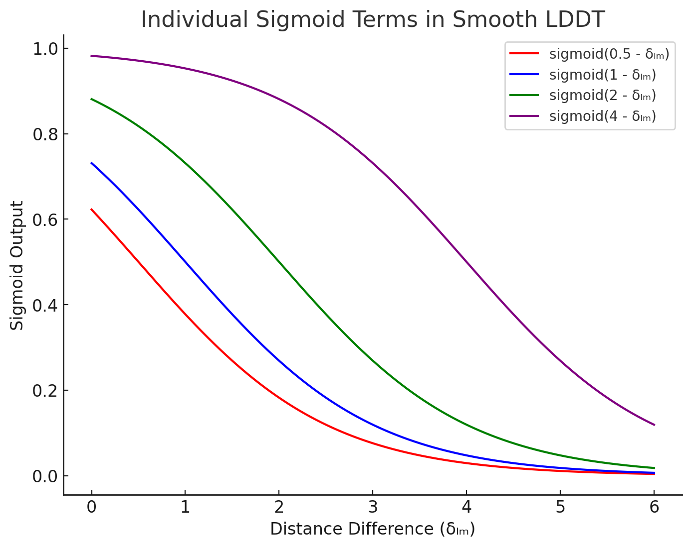
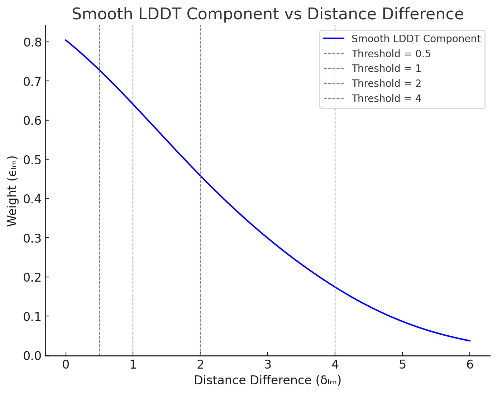

# Loss Function

最终的LossFunction的公式如下：

$\mathcal{L}\_{\text{loss}} = \alpha\_{\text{confidence}} \cdot L\_{\text{confidence}} + \alpha\_{\text{diffusion}} \cdot \mathcal{L}\_{\text{diffusion}} + \alpha\_{\text{distogram}} \cdot \mathcal{L}\_{\text{distogram}}$

其中， $L\_{confidence}= \mathcal{L}\_{\text{plddt}} + \mathcal{L}\_{\text{pde}} + \mathcal{L}\_{\text{resolved}} + \alpha\_{\text{pae}} \cdot \mathcal{L}\_{\text{pae}}$

$\mathcal{L}\_{\text{loss}} = \alpha\_{\text{confidence}} \cdot \left( \mathcal{L}\_{\text{plddt}} + \mathcal{L}\_{\text{pde}} + \mathcal{L}\_{\text{resolved}} + \alpha\_{\text{pae}} \cdot \mathcal{L}\_{\text{pae}} \right) + \alpha\_{\text{diffusion}} \cdot \mathcal{L}\_{\text{diffusion}} + \alpha\_{\text{distogram}} \cdot \mathcal{L}\_{\text{distogram}}$

- L_distogram: 用于评估预测出来的 token-level 的 distogram（也就是token-token之间的距离）是否准确。
- L_diffusion: 用于评估预测出来atom-level 的 distogram （也就是atom-atom之间的关系）是否准确，同时还包含了一些额外的terms，包括优先考虑就近原子之间的关系以及对蛋白质-配体之间的键的原子进行处理。
- L_confidence: 用于评估模型的关于对自己预测出来的结构哪些是准确或者不准确的self-awareness的准确性。

## $L_{distogram}$

- 尽管输出的结果是一个atom-level的三维坐标，但是这里的L_distogram这个loss是一个token-level的指标，表征了模型对token和token之间的距离预测的准确度，但是由于得到的是原子三维坐标，所以要计算token的三维坐标，是直接拿这个token的中心原子的三维坐标作为token的三维坐标。
- 为什么是要评估token（或者原子）之间的距离预测的是否准确，而不是直接评估token（或原子）的坐标预测的是否准确？→ 最本质的原因在于token（或者原子）的坐标在空间中睡着整个结构的旋转或者平移是可能改变的，但是他们之间的相对距离是不会改变的，这样的loss才能够体现结构的旋转和平移不变性。
- 具体的公式是怎么样的？
    
    $\mathcal{L}\_{\text{dist}} = -\frac{1}{N\_{\text{res}}^2} \sum_{i,j} \sum_{b=1}^{64} y\_{ij}^b \log p\_{ij}^b$
    
    - 这里y_b_i_j指的是将第i个token和第j个token之间的距离均匀划分到64个桶中去（从2埃到22埃），y_b_i_j指的就是在这64个桶中的某一个桶，这里y_b_i_j使用one-hot编码表示实际的结果落到某一个特定的桶中。
    - p_b_i_j指的是对第i个token和第j个token之间的距离的值落到某一个桶中的概率，是一个softmax之后的结果。
    - 对于任意一个token对（i,j)，求其预测距离和实际距离之间的差别，采用cross-entropy的方式：
        - 计算 $\sum_{b=1}^{64} y_{ij}^b \log p_{ij}^b=\log p_{ij}^{\text{target-bin}}$
    - 对于所有的token对，计算los的平均值：
        - 计算 $-\frac{1}{N_{\text{res}}^2} \sum_{i,j} \log p_{ij}^{\text{target-bin}}$ ，得到最后的L_distogram的loss的值。

## $L_{diffusion}$

- Diffusion的训练过程：（图中红框部分表示Diffusion的训练设置，这幅图表示的是AlphaFold3的总体训练设置，注意忽略了distogram loss部分）
    
    
    
    - 在diffusion的训练过程中，其首先使用trunk的输出结果作为输入，包括原始原子特征f*，更新后的token-level pair表征，token-level single 表征等。
    - 在训练过程中，Diffusion部分会使用相比于trunk部分更大的batch_size，每个样本通过trunk模块后，会生成48个相关但不同的三维结构作为diffusion模块的输入。这些结构都基于真实结构（来自于训练样本的真实三维结构）生成，但会进行随机旋转和平移，并添加不同程度的噪声。这样的做法是为了获得大量的（加噪结构，目标结构）对，让扩散模型学会如何去噪。
    - 由于加噪的大小是随机的，相当于生成了一个从t时间步(属于[0,T]，基于噪声大小的不同，t可能是接近于T-1时间步，也可能是接近于0时间步)的带噪声结构，然后希望模型经过一次diffusion module的更新后，接近T时间步，也就是完全没有噪声的状态。
    - 最后，对于这48个不同的结果，将其和Ground Truth结果进行对比，计算 loss（L_diffusion），并反向传播，优化模型（这里是仅仅优化diffusion module还是也会优化trunk module？）的参数。
- Diffusion的loss函数构造：注意这里其实是在原子层面进行loss函数计算。
    - $L_{MSE}$：用于计算目标原子坐标和预测原子坐标差值的weighted Mean Squared Error。这里已知目标用于三维坐标的原子序列：{x_GT_l}，已知预测三维坐标原子序列{x_l}，计算这两个三维结构之间的差别，具体的计算方法如下：
        - 先对目标三维结构进行一次刚性对齐，相当于把两个结构整体的位置和方向对齐，让两者在同一个参考坐标系下面进行比较，这样比较的误差就是结构本身的差异，而不是旋转或者位置偏移造成的。这也就解释了，前面计算L_distogram的时候，在没有进行刚性对齐的情况下，直接比较的是token之间的距离在真实值和预测值之间差异，而不是直接比较token的坐标的差异。
            
            
            
        - 然后计算L_mse的值： $L_{MSE} = \frac{1}{3} \cdot \text{mean}_l \big( w_l \| \tilde{x}_l - x_l^{GT-aligned} \|^2 \big)$
        - 注意这里是一个weighted Mean Squared Error： $w_l = 1 + f_l^{\text{is-dna}} \alpha^{\text{dna}} + f_l^{\text{is-rna}} \alpha^{\text{rna}} + f_l^{\text{is-ligand}} \alpha^{\text{ligand}}$ ，其中 $\alpha^{\text{dna}} = \alpha^{\text{rna}} = 5,  \alpha^{\text{ligand}} = 10$ 。这里对RNA/DNA和ligand的权重设置的较大，意味着如果这些原子的预测准确性有更高的要求。
    - $L_{bond}$ ：用于确保配体（ligand)和主链之间的键长是合理的损失函数。
        - 为什么需要这个loss呢？原因在于扩散模型可以恢复出一个总体结构正确，但是细节不够精确的模型，比如某一个化学键变得过长或者过短。同时配体就像挂在蛋白质链边上的小饰品，你不希望这个饰品过长或者过短，而蛋白质氨基酸之间的肽键基本长度是稳定的，主链内部原子排列的本身就有比较强的约束。
        - 所以这里的计算方法为： $\mathcal{L}\_{\text{bond}} = \text{mean}\_{(l,m) \in \mathcal{B}} \left( \left\| \vec{x}\_l - \vec{x}\_m \right\| - \left\| \vec{x}\_l^{\text{GT}} - \vec{x}\_m^{\text{GT}} \right\| \right)^2$ ，这里的 $\mathcal{B}$指的是一系列的原子对（l是起始原子的序号，m是结束原子的序号），代表的是protein-ligand bonds。相当于计算目标键长和真实键长之间的平均差距。
        - 本质上也是一个MSE的loss。
    - $L_{smooth-LDDT}$：用于比较预测的原子对之间的距离和实际原子对之间距离的差异的loss （Local Distance Difference Test），并且着重关注相近原子之间的距离预测的准确性（Local Distance Difference Test）。
        - 具体的计算伪代码为：
            
            
            
            - 前两步计算任意两个原子之间的距离，包括预测值和实际值。
            - 接下来计算(l,m)原子对的预测距离和实际距离的绝对差值 $\delta\_{lm}$。
            - 然后计算一个分布在[0,1]之间的评分，这个评分用于衡量 $\delta\_{lm}$ 是否能够通过（Local Distance Difference Test）。
                - 这里设置了4次Test，每次Test采用了不同的阈值，如果 $\delta\_{lm}$ 在设定的阈值范围内，则可以认为对(l,m)这个原子对距离的预测通过了Test，那么这次的Test的评分就会大于0.5，否则不通过小于0.5.
                - 所以每次Test设置了不同的阈值（分别为4, 2, 1, and 0.5 Å），采用sigmoid函数来实现：sigmoid(阈值 -  $\delta\_{lm}$ )，下面画出了这四个Test的函数曲线：
                    
                    
                    
                - 然后对这四个Test的结果进行平均，得到评分 $\epsilon\_{lm}$，这是这个评分的曲线，你会发现越靠近0，这个评分越接近于1，否则越接近于0.
                    
                    
                    
            - 然后，为了让这个计算分数主要考察的是相近原子之间的距离，所以对那些实际距离非常远的原子对，不加入到loss的计算（c_l_m=0）。即针对实际距离大于30Å的核苷酸原子对以及实际距离大于15Å的非核苷酸原子对不计入在内。
            - 最后，计算那些c_l_m不为0的原子对的 $\epsilon\_{lm}$ 评分的均值做为lddt的值，这个值越接近于1，则平均原子对预测的越准。将其换算成loss，为1-lddt。
    - 最后的最后， $\mathcal{L}\_{\text{diffusion}} = \frac{\hat{t}^2 + \sigma\_{\text{data}}^2}{(\hat{t} + \sigma\_{\text{data}})^2} \cdot \left( \mathcal{L}\_{\text{MSE}} + \alpha\_{\text{bond}} \cdot \mathcal{L}\_{\text{bond}} \right) + \mathcal{L}\_{\text{smooth-lddt}}$
        - 这里的 $\sigma_{data}$ 是一个常数，由数据的方差决定，这里取16。
        - 这里的t^是在训练时的sampled noise level，具体的计算方法是 $\hat{t}=\sigma_{\text{data}} \cdot \exp\left( -1.2 + 1.5 \cdot \mathcal{N}(0, 1) \right)$
        - 这里的 $\alpha_{bond}$ 在初始训练的时候是0，在后面fine-tune的时候是1.

## $L_{confidence}$

- 最后一种loss的作用并不是用来提升模型预测结构的准确性，而是帮助模型学习如何评估自身预测的准确性。这个loss也是四种不同用于评估自身准确性loss的一个加权和。
- 具体的公式如下： $L\_{confidence}= \mathcal{L}\_{\text{plddt}} + \mathcal{L}\_{\text{pde}} + \mathcal{L}\_{\text{resolved}} + \alpha\_{\text{pae}} \cdot \mathcal{L}\_{\text{pae}}$
- Mini-Rollout解释：
    
    
    
    - **原理**：正常情况下，要计算模型对生成的三维结构的置信度，需要获取模型最终生成的三维结构进行计算，这与AF2的做法类似。但对于AF3来说，diffusion module单次迭代无法直接生成最终的去噪结果。因此，这里引入了mini-rollout机制：在训练时对Diffusion module进行固定次数（20次）的迭代，从而让模型能从随机噪声快速生成一个近似的蛋白质结构预测。然后利用这个临时预测来计算评估指标和训练confidence head。
    - **梯度阻断**：注意这里的mini-rollout并不回传梯度（如图中红色STOP标识。不用于优化Diffusion模块也不用于优化Network trunk模块），因为计算L_confidence的主要目标是优化模型对生成结构质量的评估能力，即优化confidence module本身的性能。这种设计确保了diffusion模块的训练目标（单步去噪）和confidence head的训练目标（结构质量度量）相互独立，避免了训练目标不一致导致的冲突。同时也保证了Trunk模块的训练目标（提供更好的特征表征，为后续结构生成提供丰富且通用的特征表示）和confidence head的训练目标（结构质量度量）能够相互独立。
- 注意，这些confidence loss都只针对PDB数据集使用（不适用于任何蒸馏数据集，蒸馏数据集的结构是预测结构不是真实结构）；同时在数据集上进行过滤，只选择过滤分辨率（0.1埃到4埃之间）的真实结构进行confidence loss的训练，为了确保模型能够学习到与真实物理结构接近的误差分布。
- 下面分别详细解释每一个loss的含义：
    - Predicted Local Distance Difference Test(pLDDT)：每个原子的平均置信度。（注意Alphafold2是每个残基的平均置信度）
        - 计算单个原子的LDDT： $lddt_l$（训练时）：
            - 这里的目标是估计预测结构和真实结构之间的差异，且这里是针对特定原子的一个差异的估计。
            - 所以这里的计算公式如下设置：
                
                
                
                - 其中 $d_{lm}$ 是mini-rollout的预测的原子l和m之间的距离。
                - ${m}\in{R}$ ，m原子的选择是基于此训练序列的真实三维结构来获取：1）m的距离在l的一定就近范围内（30埃或者15埃，取决于m的原子类型）；2）m只选择位于聚合物上的原子（小分子和配体不考虑）；3）一个token只考虑一个原子，针对标准氨基酸或者核苷酸中的原子，m都是用其代表原子（ $C_\alpha$ 或 $C_1$）来表示。
                - 然后针对每一对(l,m)，进行LDDT（Local Distance Difference Test）： $\frac{1}{4} \sum_{c \in \{0.5, 1, 2, 4\}} d\_{lm} < c$，如果l和m在真实距离中比较近，那么他们在预测结果中应该也足够近，这里设置了4个阈值，如果都满足，则LDDT则为1，如果都不满足则为0。
                - 最后，相当于针对所有在l附近的m计算得到的LDDT值进行加合，得到一个l原子的 $lddt_l$ 值，其大小可以衡量在l原子上模型的预测结构和真实结构的差异，注意这是一个没有经过归一化的值。
        - 计算confidence head输出的此原子的LDDT的概率分布： $p_l^{\text{plddt}}$（训练和预测时）
            - 这里暂时忽略具体confidence的计算过程（后续会详细说明），需要知道的是这里的 $p_l^{\text{plddt}}$ 是在l原子处经过confidence head计算得到的，对 $lddt_l$ 值的分布的一个估计。
            - 这里 $p_l^{\text{plddt}}$ 是一个50维的向量，将0～100分成了50bin，是一个softmax的结果，预测了 $lddt_l$ 值落在其中特定bin的概率分布。
            - 注意这里的计算完全不涉及任何的真实结构，都是基于前面的trunk相关表征进行的预测。
        - 计算整个的 $L_{plddt}$（训练时）：
            - 那么这里这个loss的优化目标就不是最大化 $lddt_l$，而是为了更加准确地预测 $lddt_l$ 。
            - 而应该是实际的 $lddt_l$ 值和模型预测的 $lddt_l$ 分布要始终对齐：如果实际的 $lddt_l$ 值低（模型结构预测的不准）那么模型的预测的 $lddt_l$ 的分布 $p_l^{\text{plddt}}$ 结果中，落在数值较小的bin中的概率就更大；如果实际的     $lddt_l$ 值高（模型结构预测的准）那么模型的预测的 $lddt_l$ 的分布 $p_l^{\text{plddt}}$ 结果中，落在数值较大的bin中的概率就更大。
            - 所以使用交叉熵loss来对齐这两者的差异，这也就能够保证模型真实的LDDT分布和预测的LDDT分布是尽量一致的： $\sum_{b=1}^{50} \text{lddt}_l^b \log p_l^b$ 。
            - 最后，因为要计算整体的loss，所以在所有原子上进行平均，得到最终计算的方法：
                
                
                
        - 计算pLDDT的值（预测时）：
            - 另外，在预测的时候，模型输出的单个原子的pLDDT的值时，计算方式为： $p_l^{\text{plddt}} * V_{bin}$ ，得到一个0～100之间的标量，代表了模型对当前位置l原子的lddt的一个预测值。当这个原子周边的原子和它距离都比较近的时候lddt值大，代表模型对当前l原子位置预测的置信度就越高，否则对当前l原子位置预测的置信度就越低。
            - 原因在于，经过前面的loss函数的优化， $p_l^{\text{plddt}}$ 是一个对l原子的预测效果有较好评估能力的分布了。所以就可以相信 $p_l^{\text{plddt}}$ 对lddt分布的估计，可以相当于求期望的方式来求lddt的预测值。
    - Predicted Aligned Error(PAE)：token对之间的对齐误差的置信度预测（以原子对的距离来计算）。
        - 一些概念和方法解释：
            - **reference frame:** 一个token的reference frame使用三个原子的坐标来进行表示: $\Phi_i = (\vec{a}_i, \vec{b}_i, \vec{c}_i)$， 这个frame的作用是用于定义一个token i 的局部参考坐标系，用于与token j 建立联系。针对不同的token，referecne frame的三个原子的选择是不同的：
                - 针对蛋白质token，或者残基，其reference frame是： $(\text{N}, \text{C}^\alpha, \text{C})$
                - 针对DNA或者RNA的token，其reference frame是： $(\text{C1}', \text{C3}', \text{C4}')$
                - 针对其他小分子，其token可能只包含一个原子，那么选择b_i为这个原子本身，然后选择最近的atom为a_i，第二近的atom为c_i。
                - 例外：如果选择的三个原子几乎在一条直线上（它们之间的夹脚小于25度），或者在实际的链里找不到这三个原子（比如钠离子只有一个原子），那么这个frame被定义为无效frame，后续不参与计算PAE。
            - $\text{expressCoordinatesInFrame}(\vec{x}, \Phi)$ : 在 $\Phi$ 坐标系下来表示原子 $\vec{x}$ 的坐标。
                
                
                
                - 粗略的解释这个算法：
                    - 首先，从 $\Phi$ 中得到三个参考原子的坐标a,b,c。将b视作新坐标系的原点。
                    - 然后，从b到a和从b到c的方向，构造一个正交规范基(e_1, e_2, e_3)。
                    - 最后，将x投影到这个新的基上，得到x_transformed这个在新的坐标系 $\Phi$ 上的坐标。
                - 具体的详细解释这个算法：
                    - 已知三个参考原子的坐标，然后需要以b原子的坐标为原点来构建一个正交的三维坐标系。
                    - 计算w1和w2，它们是从b到a方向上的一个**单位向量**和从b到c方向上的一个**单位向量**。
                    - 然后计算正交基：
                        - e1可以看成是位于a和c之间“夹角平分”的一个方向。
                        - e2是将w1和w2相减之后的一个方向，因为w1和w2都是单位向量，所以这个向量和e1是正交的，而且也在同一个平面上。
                        - e3是将e2和e1做叉乘，得到与两者都垂直的第三个基向量，从而形成三个完整的正交基。
                        - 完成这一步后，e1，e2，e3就是一个在以b为原点下的右手系规范正交基。
                    - 最后将x投影到这个坐标系上面：
                        - 首先，将x平移，使得b成为原点。
                        - 然后，进行投影，计算d在每个基向量上的投影，即（d*e1, d*e2, d*e3）。
                        - 最后，就得到了x在坐标系 $\Phi$ 中的新坐标：x_transformed。
            - $\text{computeAlignmentError}(\{\vec{x}_i\}, \{\vec{x}_i^\text{true}\}, \{\Phi_i\}, \{\Phi_i^\text{true}\}, \epsilon = 1e^{-8} \, \text{Å}^2)$：计算token i 和 token j 之间的对齐误差。
                
                
                
                - 输入：
                    - x_i 指的是预测的针对token i 的代表性原子的坐标，x_true_i 指的是真实的token i 的代表性原子的坐标。
                    - $\Phi_i$指的是预测的针对token i 的reference frame， $\Phi_i^\text{true}$ 指的是真实的token i 的reference frame。
                - 计算流程：
                    - token对(i, j)之间关系的预测结果：在 token i 的 reference frame 局部坐标系下，计算token j 的代表性原子在这个坐标系中的坐标，相当于计算token j 相对于 token i的相对关系。
                    - token对(i, j)之间关系的真实结果：在 token i 的 reference frame 局部坐标系下，计算token j 的代表性原子在这个坐标系中的坐标，相当于计算token j 相对于 token i的相对关系。
                    - 计算对齐误差，即预测的相对位置和真实相对位置之间的差别，使用欧几里得距离来进行计算。如果e_i_j比较小，那么预测的token i 和 j 之间的关系和真实的token i 和 j 之间的关系对齐的好，否则对齐的差。
                    - 注意，这里的(i,j)是不可交换的，e_i_j和e_j_i是不同的。
        - PAE Loss 计算流程：
            - 通过confidence head计算得到的 $\mathbf{p}\_{ij}^{\text{pae}}$ 为 b_pae=64 维度的向量，表示e_i_j 落到64个bin（从0埃到32埃，每0.5埃一个阶梯）中的概率。
            - 为了使得 $\mathbf{p}\_{ij}^{\text{pae}}$ 的分布更加接近于实际的 e_i_j 的值，采用交叉熵的loss函数来对齐二者，使得 $\mathbf{p}\_{ij}^{\text{pae}}$ 能够更好地预测实际的e_i_j的值。（注意：这里loss的设计不是最小化e_i_j的值，那可能是为了获得更好的结构预测精度；而是通过交叉熵loss来更好的让预测的概率 $\mathbf{p}\_{ij}^{\text{pae}}$ 和e_i_j的结果更加的接近，从而更好地预测e_i_j的大小；e_i_j越大表明模型认为这两个位置的相对构象存在较大的不确定性，e_i_j越小意味着对于那两个位置的相对构想更有信心）
            - 所以最终PAE的loss定义为：（注意这里的e_b_i_j和前面的e_i_j不同，如果e_i_j落在对应的bin b，则这个对应的e_b_i_j是1，否则e_b_i_j是0）
                
                
                
        - 如果在预测中要计算PAE_i_j的值，则通过求期望的方式来进行计算。
            - 把64个离散的bin取其区间的中心值，然后按照位置乘以每一个位置的预测概率 p_b_i_j（即e_i_j的值落在这个bin中的概率），就得到了对于e_i_j的一个期望的值：
                
                
                
    - Predicted Distance Error(PDE)：token对之间代表原子绝对距离的置信度预测。
        - 除了对齐误差，模型同样也需要预测重要原子之间的绝对距离的预测误差。
        - 这里的distance error的计算方式比较简单，如下：
            - 首先，计算模型预测的 token i 和token j的代表性原子之间的绝对距离： $d\_{ij}^{\text{pred}}$
            - 然后，计算模型的真实的 token i 和 token j 的代表性原子之间的绝对距离： $d\_{ij}^{\text{gt}}$
            - 最后，直接计算二者的绝对差异： $e\_{ij} = \left| d\_{ij}^{\text{pred}} - d\_{ij}^{\text{gt}} \right|$
        - 类似的，通过confidence head预测出 $\mathbf{p}\_{ij}^{\text{pae}}$ 的结果也同样是64维的向量，表示e_i_j 落到64个bin（从0埃到32埃，每0.5埃一个阶梯）中的概率。
        - 类似的，然后通过交叉熵loss来对齐二者，得到L_pde:
            
            
            
        - 类似的，在预测中，使用求期望的方式来求一个token-pair的pde值：（$\Delta_b$是区间中心值）
            
            
            
    - Experimentally Resolved Prediction：预测一个原子是否能够被实验观测到
        - 这个是一个序号为原子序号l的预测置信度值，用于表示当前原子l是否能够正确地被实验观测到。
        - y_l 指的是当前的原子是否正确被实验解析，是一个2维的0/1值；p_l是一个从confidence head出来的2维向量，是一个softmax的结果，代表模型预测当前l原子是否被正确解析。
        - 最终的优化目标是预测出当前原子是否能够被实验正确解析，所以loss函数是：
            
            
            
- Confidence Head 的计算：Confidence Head的目标在于基于前面模型的表征和预测，进一步生成一系列的置信度分布（pLDDT, PAE, PDE, resolved 等的置信度分布），并可以用于后续confidence loss的计算（或者直接用于模型的输出预测）
    - Confidence Head的输入：
        - 来自最初InputFeatureEmbedder的token-level single embedding 特征 {s_inputs_i}。
        - 来自主干网络的token-level single embedding {s_i} 和 token-level pair embedding {z_i_j} 。
        - 来自diffusion module的mini-rollout预测结构： {x_pred_l}。
    - 算法计算过程解析：
        
        
        
        1. 对token-level pair embedding z_i_j进行更新，加入了从初始的 single embedding投影过来的信息。
        2. 计算模型预测出的token i和token j的代表性原子（原子序号为l_rep(i))的三维坐标之间的距离，标识为d_i_j。
        3. 把d_i_j的值离散到v_bins定义的区间上，计算出其one-hot的表征，然后经过一个线性变换，更新到token-level pair embedding上面。
        4. 继续让token-level的单体表征{s_i}和配对表征{z_i_j}进行Pairformer的更新，相当于再让这两类表征相互交互强化几轮，得到最终的{s_i}和{z_i_j}。
        5. 计算PAE的置信度概率，其最终的结果是一个b_pae=64维度的向量。因为PAE实际上也是token-token的表征（虽然实际上计算的是代表原子和frame之间的距离），所以使用{z_i_j}进行线性变换之后直接求softmax来获取这个置信度概率，代表的是其PAE的值落在64个区间中每个区间的概率。（注意：这里i和j是不可交换的）
        6. 计算PDE的置信度概率，其最终的结果是一个b_pde=64维度的向量。同理，PDE也是token-token的表征（实际上计算的是代表原子之间的绝对距离），使用z_i_j和z_j_i的信息进行融合，然后线性变换并直接求softmax来获取置信度概率，代表的是PDE的值落在64个区间中每个区间的概率。（注意：这里的i和j是可交换的）
        7. 计算pLDDT的置信度概率（注意：这里的pLDDT的置信度概率是每一个原子的值，是以原子序号l而不是token序号i来进行索引的。）
            1. 这里s_i(l)代表的含义是：获取原子l所对应的token i 对应的那个token-level single embedding.
            2. 这里的LinearNoBias_token_atom_idx(l)( … ) ，这个函数的作用是，针对不同的原子l，其对应的用于线性变换的矩阵是不同的，通过token_atom_idx(l)来获取对应的weight矩阵，矩阵形状为[c_token, b_plddt] ，然后将其右乘s_i(l)，形状是[c_token]得到最终的向量为[b_plddt]。
            3. 最后再进行softmax来得到pLDDT的置信度概率，其b_plddt=50，是一个50维度的向量，标识lddt的值落到这个50个bin范围内的概率。
        8. 计算resolved的置信度概率（注意，这里的resolved的置信度概率也是针对每一个原子的值，同上）：计算的结果经过softmax之后是一个2维的向量，预测当前原子是否能够被实验解析出来的置信度。