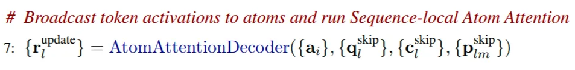

# Structure Prediction

## Diffusion的基本概念

- 在Alphafold3中整个的结构预测模块采用的方法是atom-level的diffusion。简单来讲，diffusion的具体是按照如下方式工作的：

  - 从最真实的原始数据开始，假设是一张真实的熊猫照片，然后呢不断对这张照片加入随机噪声，然后训练模型来预测加入了什么样的噪声。
  - 具体的步骤如下：
    - 训练阶段：
      - 加噪声过程：
        1. 假设x(t=0)是原始的数据，在第一个时间步，对数据点x(t=0)添加一部分噪声，得到x(t=1)。
        2. 在第二个时间步，对x(t=1)添加噪声，得到x(t=2)。
        3. 持续重复这个过程，经过T步之后，数据完全被噪声覆盖，成为随机噪声x(t=T)。
      - 模型的目标：给定某一个被噪声污染的数据点x(t)和时间步t，模型需要预测这个数据点是如何从上一步x(t-1)转变而来，即模型需要预测在x(t-1)到x(t)添加了什么噪声。
      - 损失函数：模型的预测噪声和实际添加的噪声之间的差异。
    - 预测阶段：
      - 去噪声的过程：
        1. 从纯随机噪声开始，x(t=T)是完全随机的噪声。
        2. 在每一个时间步t，模型预测这一步应该移除的噪声，然后去除这些噪声，得到x(t-1)。
        3. 重复这一过程，逐步从x(t=T)移到x(t=0)。
        4. 最终得到一个去噪声之后的数据点，应该看起来像训练数据。
- 什么是条件扩散（Conditional Diffusion）？

  - 在扩散模型中，模型还可以基于某些输入信息来“控制”生成的结果，这就是条件扩散。
  - 所以不论在训练还是预测的过程中，在每一个时间步上，模型的输入应该包括：
    - 当前的在t时刻的数据点x(t)。
    - 当前的时间步t。
    - 条件信息（如蛋白质的属性等信息，这里主要还是指的token-level和atom-level的single和pair representation 作为条件信息）。
  - 模型的输出：预测的从x(t-1)到x(t)添加到噪声（训练），或者，预测从x(t)到x(t-1)应该移除的噪声（推理）。
- Diffusion如何在Alphafold3中进行应用？

  

  - 在Alphafold3中，用于去噪的原始数据为一个矩阵x，它的维度为[N_atoms, 3]，其中3是每一个原子的坐标xyz。
  - 在训练的时候，模型会基于一个正确的的原子三维坐标序列x，在每一步进行高斯噪声的添加，直到其坐标完全随机。
  - 然后在推理的时候，模型会从一个完全随机的原子三维坐标序列出发，在每一个时间步，首先会进行一个data-augmentation的操作，对三维坐标进行旋转和变换，目的是为了实现在AF2中的Invariant Point Attention(IPA)的功能，证明经过旋转和变换之后的三维坐标是相互等价的，然后会再向坐标加入一些噪声来尝试产生一些不同的生成数据，最后，预测当前时间步降噪之后的结果作为下一步的起点。

  

## Structure Prediction 详解

### Sample Diffusion部分详解（推理过程）

- 基本的扩散过程在alphafold3中的应用，这里是指的diffusion模型的推理过程在alphafold3的推理过程中的具体算法流程，从初始状态（完全随机的三维结构），然后经过一步一步地去噪，最终返回一个去噪之后的结果（预测的三维结构）。
- 具体的算法伪代码以及解析如下所示：

  

  - 首先它的输入参数包括了很多后续用于conditional diffusion的输入，包括f*，{s_inputs_i}, {s_trunk_i}, {z_trunk_i_j} ，这些后续主要在DiffusionModule这个算法中进行处理，这里暂时忽略不讨论。
  - 其他的输入主要是diffusion算法中所需要关注的输入，包括Noise Schedule $[c_0, c_1, ..., c_T]$，缩放因子( $γ_0$ 和 $γ_{min}$)，噪声缩放系数 noise_scale $λ$ ，和步长缩放系数 step_scale η**。**他们的具体作用介绍如下：
    - Noise Schedule(噪声调度表)：定义了扩散过程中每一步的噪声强度，取值范围是[0,1]之间，它是预先设定好的一系列标量。一般情况下，噪声强度从t=0时候为最大，然后慢慢减小，到较小的t=T时候结束。
    - 缩放因子( $γ_0$ 和 $γ_{min}$)，噪声缩放系数 noise_scale $λ$ ，都是用在Sample Diffusion的推理每一步开始时，需要给上一个step的迭代结果先添加噪声，生成噪声 $\hat\xi_l$ 的作用。
    - 步长缩放系数 step scale η：主要是用于在后续x_l进行更新的时候，控制每一步迭代中输入更新的幅度，在x_l进行更新的过程中 $\vec{x}_l \leftarrow \vec{x}_l^{\text{noisy}} + \eta \cdot dt \cdot \vec{\delta}_l$ ：如果η > 1 则增大更新幅度，加快去噪过程；如果η < 1 则减小更新幅度，使得去噪过程更平滑，但是可能需要更多迭代步数。
  - 具体的算法流程解析如下：
    1. 最初的时候， $\vec{x}_l$ 是完全随机的三维噪声，维度是[3]，{$\vec{x}_l$ }的维度是[N_atoms, 3]。其中 $\mathcal{N}(\vec{0}, \mathbf{I}_3)$ 是多维正态分布，均值为三维向量 [0,0,0], 表示三个维度的均值都是0；协方差矩阵为[1, 0, 0; 0, 1, 0; 0, 0, 1]，表示各个维度之间相互独立且方差都为1.
    2. 接下来进入每一个时间步的循环，从 $\tau=1$ 开始直到 $\tau=T$：
    3. 首先进行一次数据增强，这里的目的是为了解决之前Alphafold2中使用Invariant Point Attention方法要去解决的问题，即解决旋转不变性和平移不变性，即一个序列的三维结构的坐标通过随机旋转和平移后实际上得到的新的坐标是等价的，三维结构本质不变，原子和原子之间的相对位置不变。
    4. 一般情况下，$c_\tau < \gamma_{\text{min}}$，因为这里的 $\gamma_{\text{min}} = 1$，所以 $\gamma=0$.
    5. 所以，这里的时间步 $\hat{t} = c_{\tau-1}$。
    6. 计算得到的加噪声为： $\vec{\xi}_l = 0*(\vec{0}, \mathbf{I}_3)$，并没有加什么噪声。
    7. 于是得到加了噪声最后的 $\vec{x}_l^{\text{noisy}} = \vec{x}_l$
    8. 这时候调用DiffusionModule（下一阶段会详解）计算真正此步推理的结果，得到去噪之后的结果 $\{\vec{x}_l^{\text{denoised}}\}$。
    9. 然后开始计算去噪方向的向量 $\vec{\delta}_l = \frac{\left( \vec{x}_l^{\text{noisy}} - \vec{x}_l^{\text{denoised}} \right)}{\hat{t}}$，即加噪声坐标 $\vec{x}_l^{{noisy}}$距离去噪坐标 $\vec{x}_l^{\text{denoised}}$的方向和幅度，然后进行噪声归一化，使得去噪方向在每一个时间步的噪声强度变化中保持稳定。可以将其理解为扩散过程中类似于”梯度“或者“方向导数”
    10. 然后计算时间步差值dt，当前时间步和之前时间步的差值，为更新提供了一个“步长”，从 $c_\tau$到前一个时间步参数 $\hat{t}$ 的差值，这里实际上正好就是 $dt = c_\tau - c_{\tau-1}$。
    11. 最后，更新 $\vec{x}_l$，从加噪声的坐标开始 $\vec{x}_l^{\text{noisy}}$ 其实这里就是 $\vec{x}_l=\vec{x}_l+\eta \cdot dt \cdot \vec{\delta}_l$
        。由于这里dt大概率是一个负数，所以实际上是减去噪声。

### Diffusion Module部分详解（推理过程）

- **DiffusionConditioning** : 准备token-level的 conditioning tensors ( pair表征 z_i_j 和 single 表征 s_i )
- **AtomAttentionEncoder** :  准备atom-level的conditioning tensors (pair 表征 p_l_m, single表征 q_l, c_l)，同时使用其生成token-level的 single 表征 a_i。
- **DiffusionTransformers**：token-level的single表征 a_i 经过attention计算，然后映射回 atom-level。
- **AtomAttentionDecoder：**在atom-level上进行attention计算，得到预测的atom-level的降噪结果。

注1：这里Atom-level的attention都被作者标注为local attention，token-level的attention都被作者标注为global attention，原因在于原子的数量非常大，在计算原子序列之间的attention的时候，也就是计算AtomTransformer的时候，实际上都是计算的稀疏注意力，距离当前的query原子距离过远的其他原子并不参与当前原子的attention计算，否则计算量会非常大，所以它叫做local attention。而在token-level的attention计算的时候，则是考虑了整个全局的所有token的信息，所以叫做global attention。

注2：这里的AtomAttentionEncoder中 3 blocks 和AtomAttentionDecoder 中的 3 blocks，指的就是AtomTransformer，本质上是加上稀疏偏置之后的在原子粒度上的DiffusionTransformer，而在token粒度上的DiffusionTransformer是24个blocks。

1. **DiffusionConditioning**

   - 算法伪代码如下：

     
   - 构建token-level的pair conditioning input: {z_i_j}

     

     1. 首先利用f*计算相对位置编码，这个相对位置编码是(i,j)的函数，代表任意两个token之间的相对位置关系，得到结果的维度是c_z；和z_trunk_i_j（维度也是c_z)进行拼接，得到z_i_j,维度是2*c_z。
     2. 然后将z_i_j进行layerNorm，之后再进行线性变换，变换到c_z的维度上。
     3. 最后经过两次Transition Layer的加合，得到一个新的z_i_j。
   - 构建token-level的single conditioning input: {s_i}

     

     1. 首先将s_trunk_i和s_inputs_i这两个single representation拼接起来，得到s_i，维度变成2*c_s+65（s_inputs_i的维度为c_s+65）。
     2. 然后对s_i进行归一化，然后进行线性变换，维度变成c_s。
     3. 然后对diffusion的时间步长（具体实际上就是当前时间步的noise schecule的值）信息（标量），将其映射到高维向量空间，以增强模型捕获时间步长非线性特征的能力。
        1. 具体的伪代码如下所示：

           

           1. 生成c维度的向量，每一维都是独立正态分布，得到w和b。
           2. 生成时间步的高维度向量特征，通过cos函数将标量时间步长t编码到一个高维空间中，具体生成的向量可以理解为如下图（x为时间步t，y的不同值为其在高维空间的向量）所示，每一个t切面就是一个t时刻的高维向量。

              

              - 不同的频率捕捉了时间步长的多尺度特征（低频表示全局动态，高频表示局部细节）
              - 偏移量增加了嵌入的多样性，使模型能学习到更复杂的时间特征。
        2. 将高维时间步信息先进行归一化，然后进行线性变化后 (n → c_s)，加入到token-level 的 single 表征s_i中去了。
        3. 再经过两次Transition layer的加合，得到一个新的s_i ，维度为c_s。
   - 通过在此DiffusionCondition部分加入diffusion时间步信息，使得模型在进行de-noising过程中能够知道当前diffusion过程的时间步，并且预测出需要去掉的正确尺度的噪声。
   - 经过DiffusionCondition的结果是在token-level尺度上的信息，接下来需要在atom-level计算原子级别的信息。
2. **AtomAttentionEncoder**

   - 首先将x_noisy_l 进行缩放，转换为单位方差为1的单位向量，其缩放后的结果是一个无量纲的数值，便于保持数值的稳定性。

     
   - 然后正式进入AtomAttentionEncoder函数进行计算：

     

     - AtomAttentionEncoder的输入包括：{f*}(原始特征参考构象特征), {r_noisy_l}(加入当前噪声的当前时间步原子坐标), {s_trunk_i}(经过Pairformer的token-level single表征) , {z_i_j}(经过DiffusionConditioning之后的token-level的Pair 表征)
     - AtomAttentionEncoder的输出包括：a_i(token-level的single表征)，q_l(本模块计算得到的atom-level的single表征)，c_l(基于参考构象获取的atom-level的初始表征)， p_l_m(本模块计算得到的atom-level的pair表征)。
     - AtomAttentionEncoder的伪代码如下：（diffusion新增的部分突出显示）

       

       - 首先，从原始参考构象表征中计算得到c_l，并将q_l的初始值设定为c_l，然后然后从参考构象表征中计算atom-level的pair表征p_l_m。
       - 接着，然后单r_l不为空的时候（就是当前diffusion部分的推理过程时）：
         - 使用s_trunk这个token-level的single特征，获取其在atom序号l对应的token序号tok_idx(l)，然后获取这个token序号对应的s_trunk的向量，维度为c_s(c_token)，然后进行LayerNorm之后，进行线性变换，维度从c_s → c_atom。然后再加上c_l本身，得到新的c_l，具体过程如下所示：

           
         - 使用z这个token-level的pair特征，获取atom序号l和m的对应的token序号tok_idx(l)和tok_idx(m)，然后获取这个两个维度序号对应的z的向量，维度为c_z,然后进行LayerNorm之后，进行线性变换，维度从c_z → c_atompair。最后再加上p_l_m本身，得到新的p_l_m，具体过程如下所示：

           
         - 针对加入当前噪声的当前时间步原子坐标r_noisy_l，将其进行线性变换之后，维度变换3→c_atom，加合到q_l上，得到最新的q_l结果。
       - 最后，基于c_l对p_l_m的结果进行更新，将p_l_m经过3层MLP得到行动p_l_m，然后通过AtomTransformer计算得到最新的q_l，最后将q_l这个atom-level的single表征，在不同的token维度上求平均，得到a_i（token-level 的single表征）的结果。于是，通过AtomAttentionEncoder就得到以下结果：
         - {q_l}：更新之后的atom-level的single表征，包含了当前atom的坐标信息。
         - {c_l}：atom-level的single表征，基于Pairformer的token-level single表征更新过的变量，主要起的作用是基于Trunk进行conditioning。
         - {p_l_m}: atom-level的pair表征，用于后续的diffusion的conditioning。
         - {a_i}：token-level的single表征，从q_l中聚合而来。同时包含了atom-level的坐标信息和token-level的序列信息。
3. **DiffusionTransformers**

   - 具体的伪代码如下所示：这一部分主要是对上一步计算出来的token-level的信息a_i（其包含了原子三维坐标信息和序列信息）进行self-attention。

     

     - 首先，对从**DiffusionConditioning**计算得到的token-level single表征{s_i}出发，计算它的LayerNorm结果之后，在进行线性变换，将其变换到a_i的维度，线性变换维度为 c_token → c_s，然后在加上{a_i}本身进行element-wise add，得到新的{a_i}。
     - 然后，对token-level的信息{a_i}进行attention，并且使用从DiffusionConditioning计算得到的{s_i}和{z_i_j}进行conditioning，注意这里的DiffusionTransformer和在之前的所有DiffusionTransformer的一个大的区别是，这里是针对token-level的（Token-level equivalent of the atom transformer），所以这里的 $\beta_{ij} = 0$ 表示不加入稀疏attention的偏置。下面也给出一个示意图：

       
     - 最后，a_i经过一个LayerNorm并进行输出，维度为 c_token。
4. **AtomAttentionDecoder**

   伪代码如下：

   

   - 现在，我们返回到Atom空间，使用更新之后的 a_i 来将其广播到每一个atom上，以更新atom-level的single表征 q_l。

     
   - 然后，使用Atom Transformer来更新q_l。

     
   - 最后，将更新后的q_l经过LayerNorm和线性变换之后，映射到原子序列的三维坐标上，得到r_update_l。

     
   - 最后的最后，在AtomAttentionDecoder之外，将“无量纲（dimensionles）”的r_update_l，重新rescale到非单位标准差的 x_out_l上去，返回的就是x_denoised_l。

     
